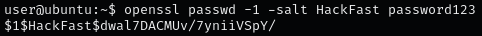
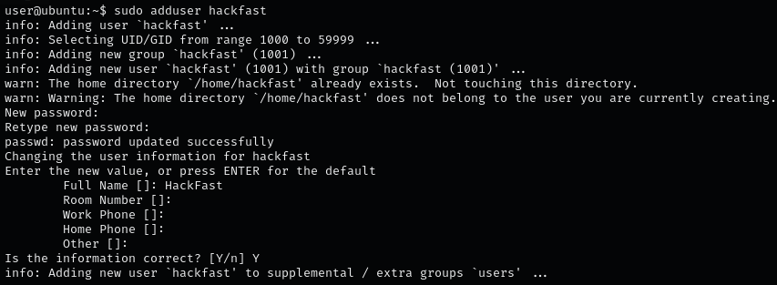

### **Step 1. Generate a Password**

1.  Generate a hashed password using OpenSSL. Replace \[SALT\] and \[PASSWORD\] with your chosen salt and password.  
    `openssl passwd -1 -salt [SALT] [PASSWORD]`

    
    
2.  Understand the /etc/passwd file structure. Each line represents a user and is formatted as follows:  
    `$UserName:$generated_password:$UID:$GUID:$comment:$home_dir:$default_shell`
    
    - `$generated_password:` The hashed password generated in the previous step.
    - `$UID:` User ID, a unique number assigned to each user.
    - `$GUID:` Group ID, a unique number assigned to each group.
    - `$comment:` Usually the user full name.
    - `$home_dir:` The path to the user's home directory.
    - `$default_shell:` The default shell for the user.
3.  Create a new entry in the /etc/passwd file using the generated password hash. Ensure you follow the local standards of the file format:  
    `hackfast:$1$mysalt$hREc3A9Q3vWq/TYxhRgW80:1001:1001:Hackfast User:/home/hackfast:/bin/bash`
    

### **Step 2: Verify the New Entry**

1.  Check the /etc/passwd file to ensure your new entry is correctly added and there are no syntax errors:  
    `cat /etc/passwd | grep 'hackfast'`  
    
    

2.  Grant sudo privileges to the new user:  
    `sudo usermod -aG sudo hackfast`

### **Step 3: Alternative Method (Recommended)**

1.  Add the new user using the adduser command:  
    `sudo adduser hackfast`  
    
    

    Follow the prompts to set the user password and other details.
2.  Grant administrative (sudo) privileges to the new user:  
    `sudo usermod -aG sudo hackfast`

### **Step 4. Test the New Account**

1.  Switch to the new user to verify that the account was created successfully:  
    `su - hackfast`
2.  Check your identity to confirm the user switch:  
    `whoami`