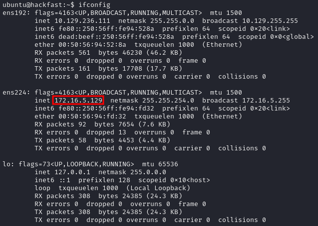
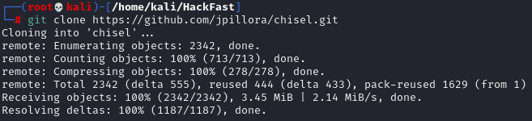
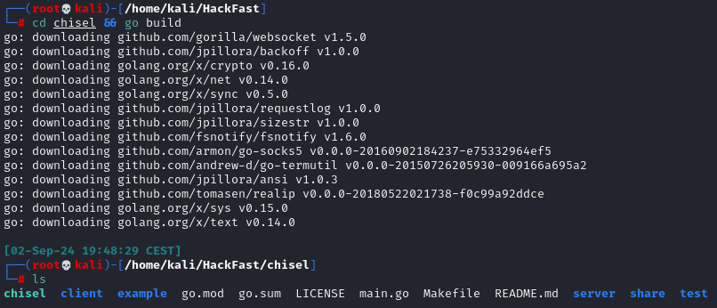
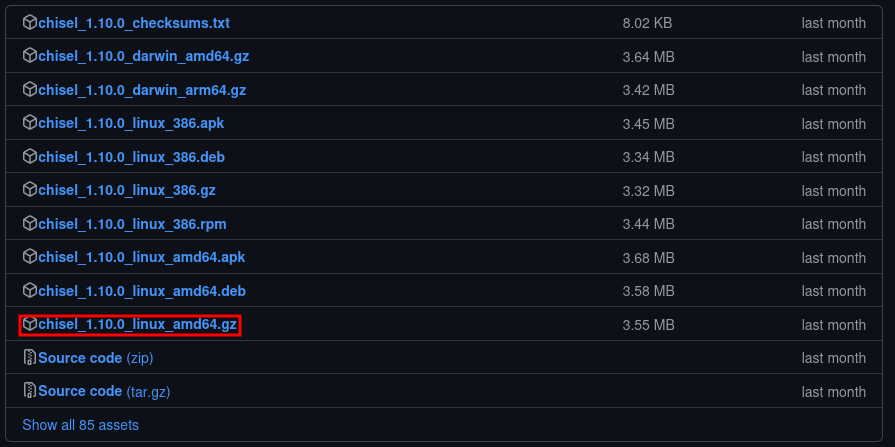
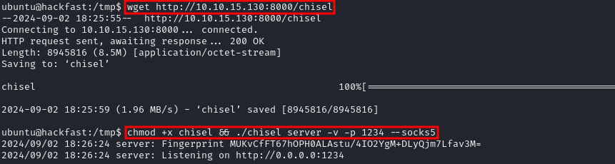
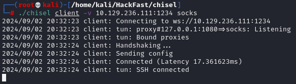
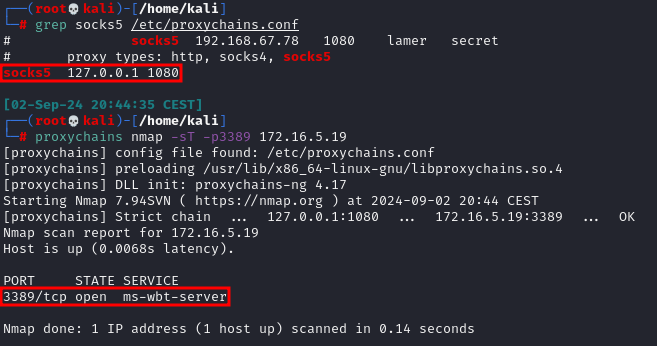

1.  Run `ifconfig` and look for extra interfaces, in this example, we find `ens224`, which connects to a network our current machine can't reach directly.
    
    
    
2.  If Chisel has not yet been installed, clone the repository using the following command:   
    `git clone https://github.com/jpillora/chisel.git`  
    
    
    
3.  Navigate to the Chisel directory and build the binary using the command below:  
    `cd chisel && go build`  
    
    
    
4.  Alternatively, if you prefer not to build the binary yourself, you can download a [pre-built](https://github.com/jpillora/chisel/releases) version. After downloading, unzip the file using:  
    `gzip -d chisel_1.10.0_linux_amd64.gz`  
    
    
    
5.  Transfer the Chisel binary to the target machine (Refer to the File Transfer section for more details). Then, execute the Chisel server with:  
    `chmod +x chisel && ./chisel server -v -p 1234 --socks5`  

     

    ??? info "NOTE"

        The Chisel server will listen for incoming connections on port 1234, utilizing SOCKS5 (--socks5), and forward traffic to all networks accessible from the pivot host. In our scenario, the pivot host has an interface on the 172.16.5.0/23 network, enabling us to reach hosts within this network.
    
6.  On the attack host, start the Chisel client and connect to the Chisel server using:  
    `./chisel client -v 10.129.236.111:1234 socks`  
    
    
    
7.  Modify the proxychains.conf file to include the following configuration:  
    `socks5 127.0.0.1 1080`  
    
    