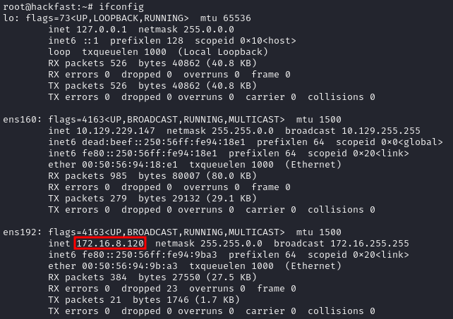
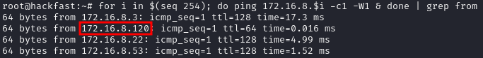
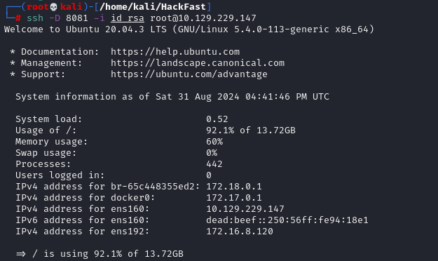
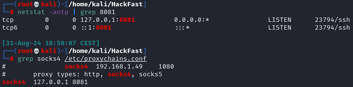
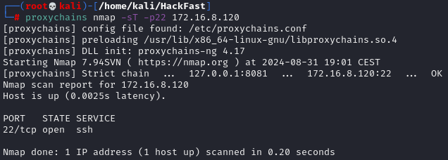

1.  By using the `ifconfig` command, we observe that there is another network interface `ens192`, which is part of a network that our current machine does not have direct access to.  
    
    
    
2.  To discover Active hosts within the 172.16.8.0/23 subnet, we can use the following command:   
    `for i in $(seq 254); do ping 172.16.8.$i -c1 -W1 & done | grep from`  
    
    
    
3.  We can use the following command to establish an SSH pivot using dynamic port forwarding    
	`ssh -D 8081 -i id_rsa root@10.129.x.x`

     

    ??? info "NOTE"

        When using a password, you’ll need to enter it after executing the command without the `-i id_rsa` option.
    
4.  Next, we need to modify the /etc/proxychains.conf to use the port we specified with our dynamic port forwarding command (8081 here).  
	```
	netstat -antp | grep 8081
	grep socks4 /etc/proxychains.conf
	```
	
    
5.  With everything set up, we can now use Nmap (or other tools) to scan through the pivoting:  
    
    