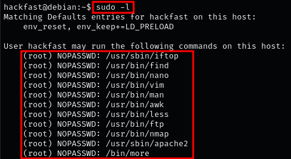
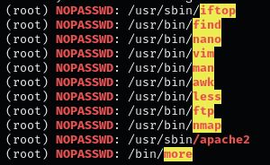
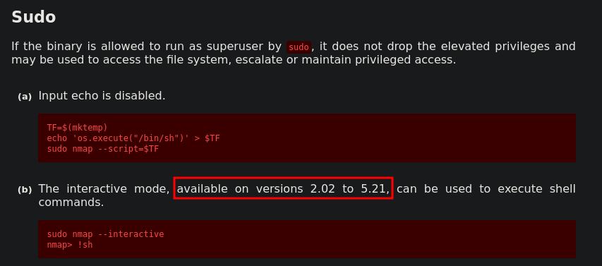
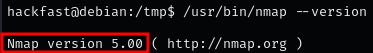
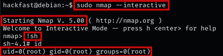
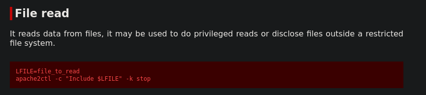
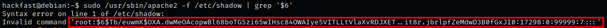

### **WHAT IS SUDO?**

Sudo, which stands for “super user do”, is a program (binary) that allows a user to run a program as another user (most often root),The primary purpose for **sudo** is to allow a user to run a program as root that they cannot otherwise run being a standard user. This creates a more “secure” landscape as the user does not need to login as root or **su root** to run a program as root, they can simply use **sudo** instead.

### **ABUSING INTENDED FUNCTIONALITY**

The sudoers file `/etc/sudoers` can be configured a number of ways, but for the most part it is pretty easy to understand. We will often see things like “ALL” and “NOPASSWD”, and sometimes a username such as root or something else, like so:

1.  Any command can be run as any user/group.  
    `(ALL : ALL) ALL`
2.  Only the specified program can be run.  
    `(ALL : ALL) /some/program`
3.  No password required for specified commands.  
    `(root) NOPASSWD: ALL`
4.  A specific user can run a specific program.  
    `(user) /some/program`

### **ENUMERATE SUDO PRIVILEGES**

1.  List the programs that our current user can execute with Sudo privileges:  
    `sudo -l`  
    
    

    **NOTE:** Here we can see that our current user hackfast has the ability to run quite a few programs with sudo, and for most of them, without the need to supply a password, because NOPASSWD has been set on some of the entries.
2.  Automating SUID/SGID Enumeration binaries with LinPEAS  
    
    

    **NOTE:** This shows us that a lot of these binaries that we can run with sudo are red/yellow, which means there is a 95% chance that they will result in a root escalation.

### **EXPLOITING SUDO COMMANDS – GTFOBINS**

To kickoff the exploitation examples, we are going to exploit four of the the red/yellow findings above using GTFOBins,For all of the exploits available on GTFOBins, there is one thing they all have in common – they assume execution as root, not every vulnerable entry in the **sudoers** file results in an immediate root shell. Instead, they may provide the ability to do things such as read or write a file as root.

### **EXPLOITING EASY SHELL BINARIES – NMAP**

1.  we can see there are two different exploits on GTFOBins that look interesting.  

    

    **NOTE:** The first one creates a script that executes /bin/sh and then executes the script with nmap.the second one utilizes an “interactive” mode that can be broken out of as root. However, this exploit has a version requirement and only works on versions 2.02 – 5.21.
    
2.  Since exploit B is “easier”, we can check which version of nmap is running on the host.  
    `/usr/bin/nmap --version`  

    

    **NOTE:** We can see the version is 5.00, which falls in the vulnerable range.
    
3.  Since the version is vulnerable to exploit (b), we can simply use the commands provided by GTFOBins and get a root shell.  
    `sudo nmap --interactive`, `!sh`  
    
    
    
    **NOTE:** When using the exploits found on GTFOBins, always use the absolute path to the binary found in the sudo -l output.
    

### **APACHE2 – FILE READ VULNERABILITY**

When it comes to file read exploits, there are a few key files we want to try and target.,Right out of the gate we can target the /etc/shadow file and then start cracking hashes; however, another good file we can look for is a root SSH key,While cracking hashes might get us the root password – an SSH key will get us instant access as root.

1.  check how to read files with Apache2 from GTFOBins.  
    
    

    **NOTE:** Here we can see that GTFOBins uses a variable to set the file to read, but we don’t need to do all that,Instead, we can just run the second command and specify the file we want to read directly on the command line.
    
2.  For example, if we want to grab all the hashes from the shadow file, we can do that with the following:  
    `sudo /usr/sbin/apache2 -f /etc/shadow | grep '$6'`  
    
    

    **NOTE:** To learn how to crack Shadow hashes using John the Ripper, check out cracking section
    
3.  Alternatively, we might get lucky and find an SSH key.  
    `sudo /usr/sbin/apache2 -f /root/.ssh/id_rsa`  
    **NOTE:** To learn how to crack Shadow hashes using John the Ripper, check out Cracking Section