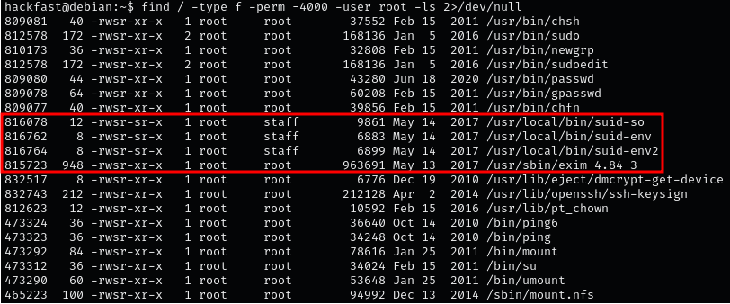

1.  To hunt for all SUID binaries on the system  
    `find / -type f -perm -u=s 2>/dev/null`  
    
    
    
2.  To search for SUID binaries owned by root and include the `-ls` flag to view file permissions  
    `find / -type f -perm -4000 -user root -ls 2>/dev/null`  

     

    **NOTE:** Right away we can see there are a lot of SUID binaries; however, that does not mean they are all interesting to us.
    
3.  You can search for both SUID and SGID at the same time  
    `find / \( -perm -4000 -o -perm -2000 \) -type f -exec ls -la {} \; 2> /dev/null`  
    
    
    
4.  Automating SUID/SGID Enumeration binaries with LinPEAS   
    `./linpeas.sh`  
    
    

    **NOTE:** All red/yellow findings you may come across. Exploits for each can be found on [GTFOBins](https://gtfobins.github.io/#+suid).
    
5.  we can see that LinPEAS also found four other binaries that are interesting to us because they are “unknown”. This typically means these are custom SUID binaries, which deserve a closer inspection.  
    
    