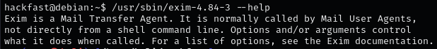
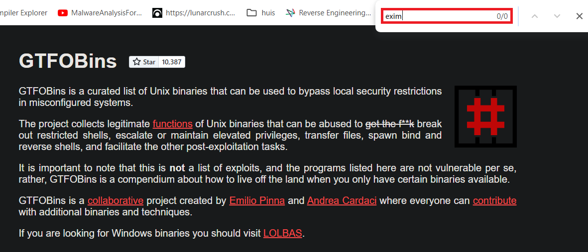
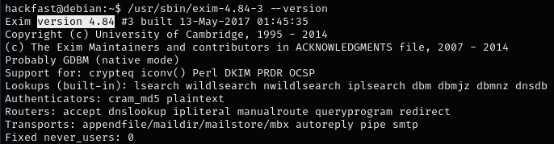
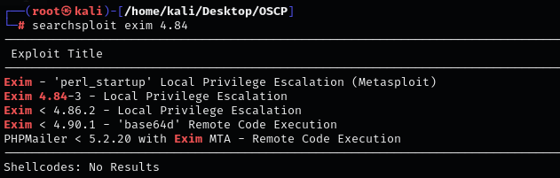
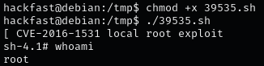

1.  Let’s have a look at the exim binary that we found during our enumeration,when facing a binary we are not familiar with, we run it to see what it does.  
    `/usr/sbin/exim-4.84-3 --help`  
    
    
    
2.  Here we can see the binary does have sort of help menu, which means it is not a simple “in-house” custom binary. This tells us that Exim is a Mail Transfer Agent,This is interesting and may be listed on GTFOBins, so this one we will check.  
    `https://gtfobins.github.io/`  
    
    

    **NOTE:** We did not find the Exim binary listed on GTFOBins.
    
3.  We need to determine the version of the binary to search for any public exploits available  
    `/usr/sbin/exim-4.84-3 --version`  
    
    
    
4.  We were able to extract the version of exim 4.84 Now, we can search on searchsploit to see if there are any public exploits available for this version.  
    `searchsploit exim 4.84`  
    
    
    
5.  Let's Download the exploit, then transfer it to the target system to gain elevated privileges.  
    `searchsploit -m linux/local/39535.sh`  
    
    