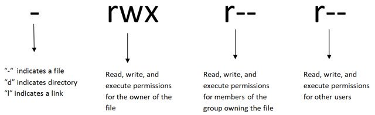
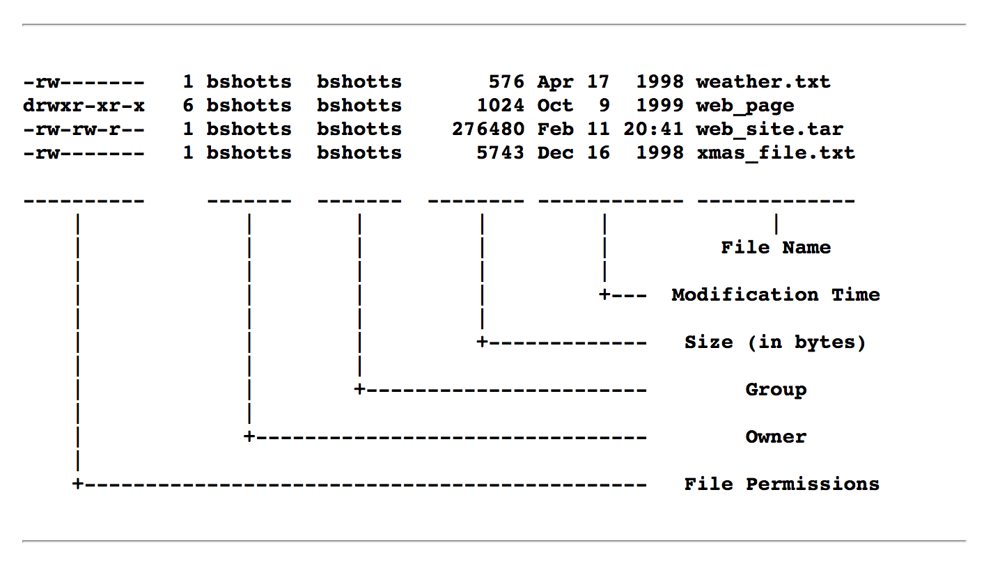

### **FILE PERMISSIONS IN LINUX**

The concept of permissions and ownership is crucial in Linux. On a Linux system, each file and directory is assigned access rights for the owner of the file, the members of a group of related users, and everybody else.

### **OWNERSHIP TYPES**

- **OWNER**: The Owner permissions apply only to the owner of the file or directory.
- **GROUP**: The Group permissions apply only to the group that has been assigned to the file or directory.
- **OTHER USERS**: The other users’ permissions apply to all other users on the system that are not the owner, nor part of the group.  
      

    

### **DIRECTORY PERMISSIONS IN LINUX**

| PERMISSIONS | NUMERIC CODE | DESCRIPTION |
| --- | --- | --- |
| `----------` | `0000` | No permissions |
| `-rwx------` | `0700` | Read, write, & execute only for owner |
| `-rwxrwx---` | `0770` | Read, write, & execute for owner and group |
| `-rwxrwxrwx` | `0777` | Read, write, & execute for owner, group, and others |
| `---x--x--x` | `0111` | Execute only |
| `--w--w--w-` | `0222` | Write only |
| `--wx-wx-wx` | `0333` | Write & execute |
| `-r--r--r--` | `0444` | Read only |
| `-r-xr-xr-x` | `0555` | Read & execute |
| `-rw-rw-rw-` | `0666` | Read & write |
| `-rwxr-----` | `0740` | Owner can read, write, & execute; group can only read; others have no permissions |

