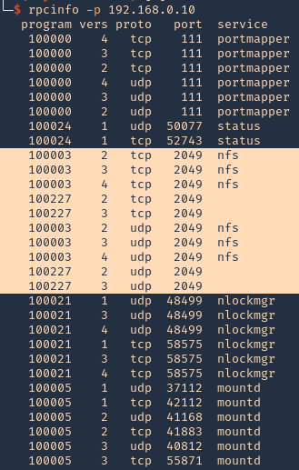
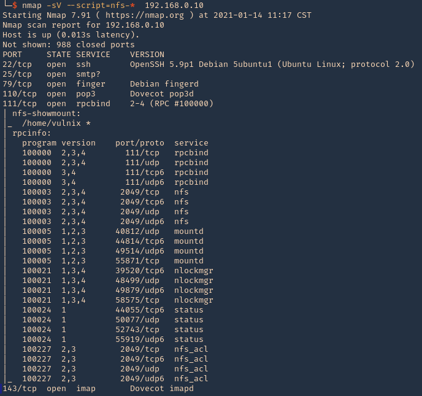

### **Introduction**

NFS (Network File System) is a protocol that allows users to access files over a network as if they were local. Developed by Sun Microsystems, it operates on a client-server model where the server manages files and clients access them remotely. NFS is known for its simplicity and efficiency due to its stateless nature, which reduces server load. It is widely used in UNIX/Linux systems and supports cross-platform.

### **Nfs server enumeration**

| METHOD | TOOL / COMMAND | DESCRIPTION |
| --- | --- | --- |
| Shodan Search | `port:2049` | Identify NFS services exposed on the internet, which can be potential targets for further investigation. |
| NFS Service Detection | `nmap -n -PN -sS -T5 -p 2049 --script=nfs-showmount [IP-ADDRESS/RANGE]` | Basic NFS detection to find NFS servers in a specified subnet. |
|  NFS Scanning | `nmap --script=nfs-ls.nse,nfs-showmount.nse,nfs-statfs.nse -p 2049 [IP-ADDRESS]` | Perform a detailed scan to enumerate files, mount points, and system statistics of NFS servers. |
| Metasploit NFS Detection | Use Metasploit `auxiliary/scanner/nfs/nfsmount` | Scans for NFS mounts in a network range to identify exposed network shares that could pose security risks. |
| Listing NFS Exports | `showmount -e [IP-ADDRESS]` | Display all exported directories available on a specified NFS server. |

### **MISCONFIGURATION EXPLOITATION**

| MISCONFIGURATION TYPE | POTENTIAL RISK | MITIGATION STRATEGY |
| --- | --- | --- |
| no_root_squash | Gives root user on the client the ability to access files on the NFS server as root. | Avoid using `no_root_squash` in `/etc/exports`. Configure `root_squash` to prevent root access escalations. |
| no_all_squash | Applies to non-root users, allowing escalated privileges if exploited. | Ensure that `no_all_squash` is not used carelessly. Regularly audit the NFS server configurations and access controls. |

### **MOUNT SHARE**

1.  Enumerating RPC Services  
    `rpcinfo -p [IP-ADDRESS]` 
``` hl_lines="9 11"
 program vers proto   port  service
 100000    4   tcp    111  portmapper
 100000    3   tcp    111  portmapper
 100000    2   tcp    111  portmapper
 100000    4   udp    111  portmapper
 100000    3   udp    111  portmapper
 100000    2   udp    111  portmapper
 100024    1   udp  50077  status
 100024    1   tcp  52743  status
 100003    2   tcp   2049  nfs
 100003    3   tcp   2049  nfs
 100003    4   tcp   2049  nfs
 100227    2   tcp   2049  nfs
 100227    3   tcp   2049  nfs
 100003    2   udp   2049  nfs
 100003    3   udp   2049  nfs
 100003    4   udp   2049  nfs
 100227    2   udp   2049  nfs
 100227    3   udp   2049  nfs
 100021    1   udp  48499  nlockmgr
 100021    3   udp  48499  nlockmgr
 100021    4   udp  48499  nlockmgr
 100021    1   tcp  58575  nlockmgr
 100021    3   tcp  58575  nlockmgr
 100021    4   tcp  58575  nlockmgr
 100005    1   udp  37112  mountd
 100005    1   tcp  42112  mountd
 100005    2   udp  41168  mountd
 100005    2   tcp  41883  mountd
 100005    3   udp  40812  mountd
 100005    3   tcp  55871  mountd
```
    

2.  Running NSE Scripts to Enumerate RPC Services  
    `nmap -sV --script=nfs-* [IP-ADDRESS]`  
    
    
    
3.  Enumerate shares With showmount command  
    `showmount -e [IP-ADDRESS]`  

4.  Create a Directory for Mounting the Share  
    `mkdir /tmp/nfs`
    
5.  Mount the NFS Share to the New Directory  
    `sudo mount -t nfs [IP-ADDRESS]:/home/share /tmp/nfs -nolock`
    
6.  Navigate to the mounted directory to access the NFS share:  
    `cd /tmp/nfs`