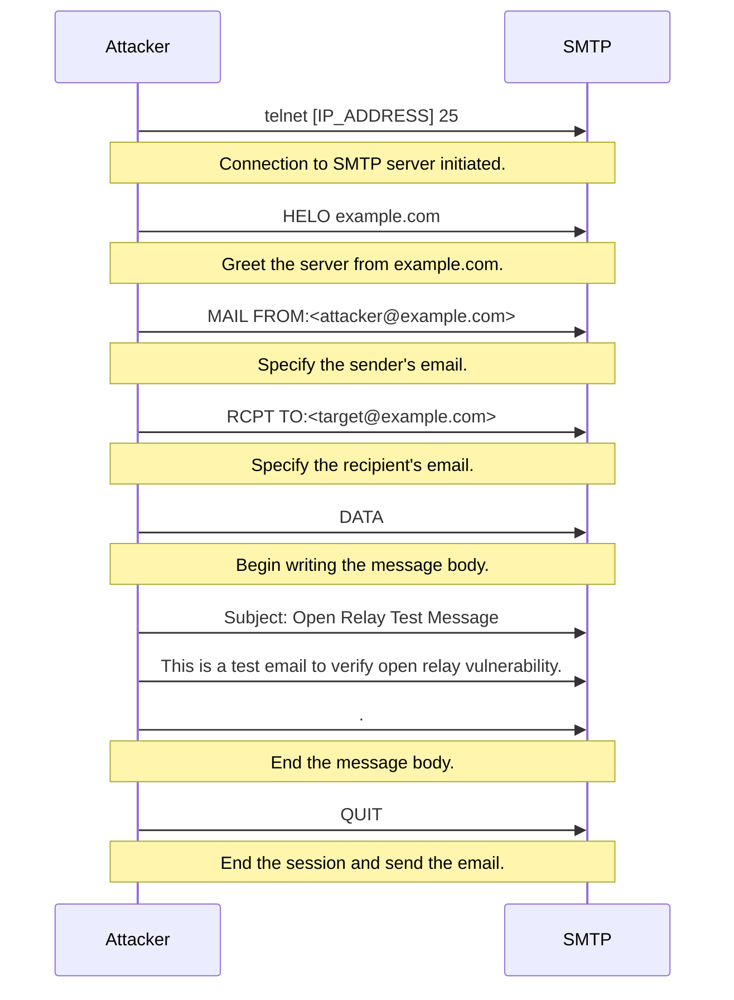

### **Introduction**

SMTP (Simple Mail Transfer Protocol) is a protocol used to send emails between servers. It typically runs on ports 25 and 587. While SMTP handles message delivery, it does not encrypt data by default, which can expose sensitive information unless combined with TLS/SSL.

### **Nmap NSE Scripts for SMTP**

Use Nmap scripting engine to discover misconfigurations, test for vulnerabilities, and enumerate SMTP features:

| Command | Description |
| --- | --- |
| `ls -la /usr/share/nmap/scripts \| grep "smtp"` | Lists all available NSE scripts related to SMTP. |
| `nmap -p 25 --script smtp-open-relay [TARGET-IP]` | Checks if SMTP server is an open relay, which could be abused to send spam emails. |
| `nmap -p 25 --script smtp-enum-users --script-args smtp-enum-users.methods={VRFY} [TARGET-IP]` | Enumerates users on an SMTP server using the VRFY command to gather potential email targets. |
| `nmap -p 25 --script=+smtp* -oN smtp_scan_results.txt [TARGET-IP]` | Performs a detailed scan of SMTP-related services and saves the results to a file. |

### **Manual Open Relay Test**

